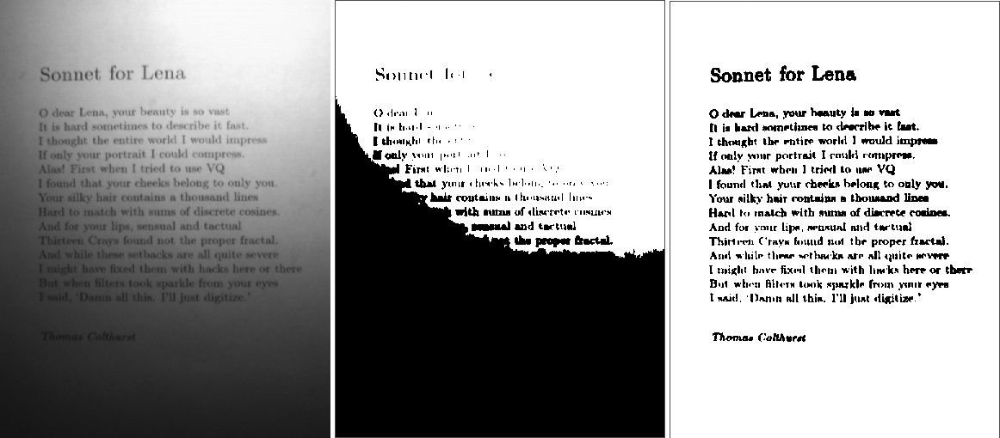
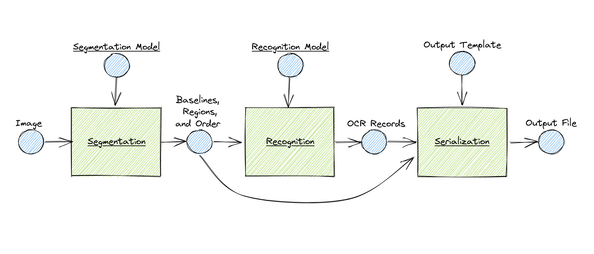
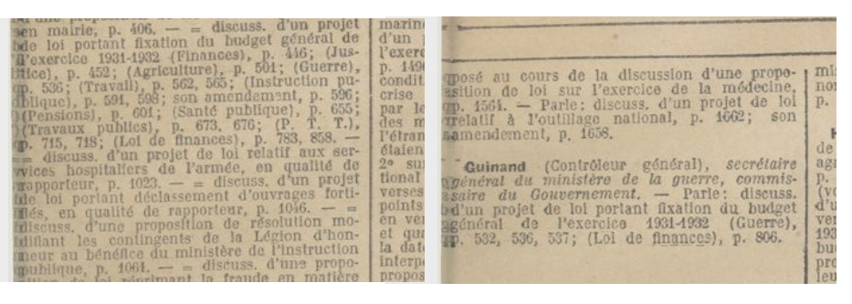
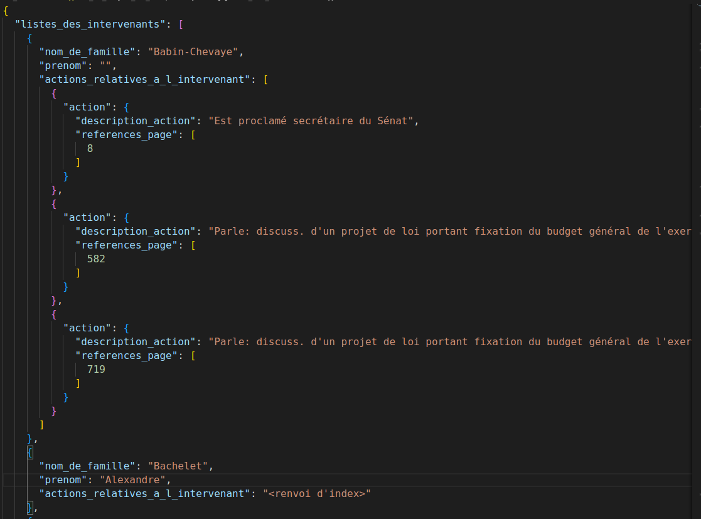
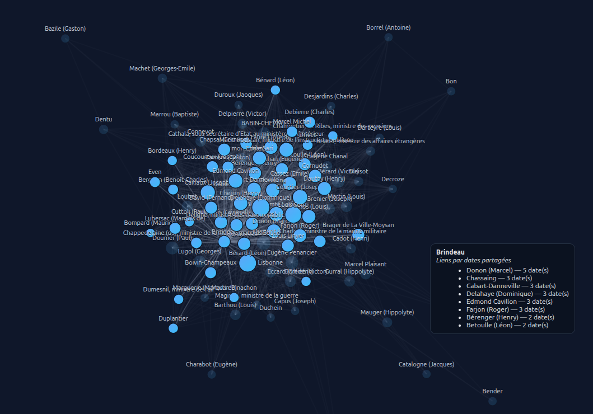
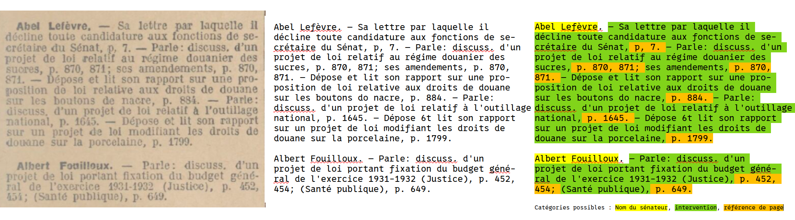
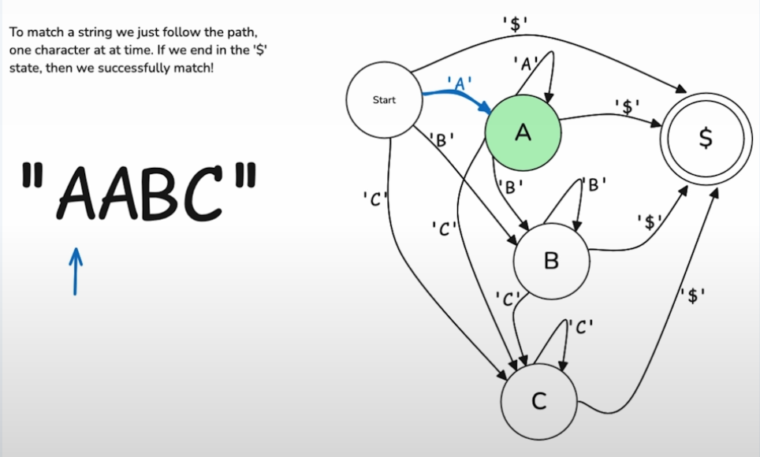

# Une histoire par les données

Nous venons de voir que les *Tables Annuelles* du Sénat contiennent une véritable mine d'informations pour établir une analyse de l'activité parlementaire. Ces *Tables*, accessibles sur Gallica, avec le jeu des renvois et des index, sont de véritables bases de données de papier. Pour récupérer les informations du *Journal Officiel* de façon automatisée, c'est-à-dire sans reproduire à la main l'ensemble, il faut penser à une chaîne de traitement qui part de ces sources numériques, sous format image, pour pouvoir en capturer l'information. Il s'agit ici de voir comment construire un protocole d’extraction cohérent, en tenant compte de la matérialité des documents eux-mêmes, aussi bien sous leur forme "analogique" que numérique. 

Dans ce chapitre, il s'agira de répondre aux problématiques techniques de cette traduction des sources numérisées -- c'est-à-dire sous format image -- au texte. Ceci imposant de donner un contexte préalable de cette "mise en données"[@clavert] des sources historiques, laquelle est inhérente à la disponibilité de corpus numérisés par les politiques de valorisation des fonds des institutions patrimoniales. 

Comment travailler à partir d'une image numérique ? Certes, la représentation photographique et numérique d'un document est lisible pour un oeil humain; mais du point de vue informationnel, ces images ne sont que des paquets de pixels, une conversion numérique de l'information lumineuse renvoyée par les objets photographiés[@claerr]. Ces pixels ne sont pas, évidemment, les lettres elles-mêmes. Ils sont la traduction sur l'écran de trains d'informations binaires qui, sans le bon décodage, pourrait vouloir dire tout autre chose. Le premier enjeu pour un travail de capture de l'information est de transformer cette matière matricielle en information textuelle sur laquelle on peut appliquer des traitements. Le texte se présente comme pré-requis pour établir des chaînes de traitement de capture informationnelle. Ce passage de l'image au texte numérique est en fait techniquement une prérogative des tâches de *reconnaissance optique des caractères* -- ou "OCR" (*Optical Character Recognition*). Elle butte également sur des problématiques de détection de la mise en page, laquelle fonde un ordre de lecture -- et donc un agencement du sens des phrases qu'il faut considérer. [Section 2 : de l'image au texte]

Deuxième problème : une fois ce texte numérique obtenu, comment capturer l'information sémantique qui est présente ? Comment l'ordinateur peut comprendre que tel ensemble des caractères alphanumériques correspond en fait à un sénateur de la Troisième République ? On peut trouver, dans le document, des motifs qui signalent une entité (par exemple, le nom d'un sénateur). Cette approche comme on va le voir, est basée sur la reconnaissance de motifs typographiques. Elle est cependant fragile et dépendante de la qualité de l'OCR -- voire des erreurs humaines présentes dans le document d'origine. Elle suppose aussi une forme de connaissance *a priori* synthétique de la représentation de l'information dans le document. Ainsi peut-on se tourner vers des approches extractives qui viennent labelliser l'information textuelle obtenue[@finkel]; ou bien les approches génératives qui "lisent" le texte et restituent l'information comprise et permettent de contourner le problème des exceptions qui forment le corps des documents[@radford]. Cette chaîne de travail de capture exige une information exploitable par l'ordinateur; elle a besoin d'une certaine systémacité, laquelle est une prérogative des modèles de données -- de leur "forme". La chaîne de traitement commence donc avec l'image, passe par le texte et des méthodes de capture de l'information sémantique qu'elle contient, pour aboutir à une information structurée. L'enjeu n'est pas simple car chaque étape reporte les marges d'erreur des précédentes. [Section 3]

Dans ce chapitre, il s'agira ainsi de dessiner le contexte technique et institutionnel de cette "*datafication*" des données en vue de leur traitement -- et notamment avec les nouvelles opportunités des grands modèles de langage.

## Numériser les sources

### En "mode texte"

En 1971, un étudiant reproduisait sur un ordinateur *Xerox* la *Déclaration d'indépendance des Etats-Unis*, en caractères alphanumériques **ASCII**. Il s'agissait de Michel Hart, fondateur du **Projet Gutenberg** qui se donnait pour tâche de reproduire et diffuser bénévolement sur le réseau internet des oeuvres littéraires du domaine public. Des livres comme *La Bible*, des oeuvres de Shakespeare, quelques autres de Lewis Carroll ou de James M. Barrie seront notamment reproduites [@lebert]. Ce travail de "numérisation" est en fait un travail laborieux, sinon de tâcheron : chacune des lettres de chaque livre sera tapée à la main, les unes après les autres. En 1990, avec les débuts du Web, le projet prend un nouvel essor et bénéficie d'une collaboration internationale : les collections s'élèvent à environ 1000 livres en 1997; 4000 livres en 2001; et $15000$ livres en 2005 [@lebert]. Entre le livre et la version numérique, il n'y a pas d'images : juste le travail manuel de transcription des caractères. C'est une numérisation des livres "en mode texte" [@bermesbook, 30-33] : l'information textuelle seule, stockée sur disque dur, est reproduite sur l'écran, cela "destructurant l'objet livre" [@bermesbook]. En effet, avec cette reproduction en caractères alphanumériques, la structure physique du livre -- sa mise en page -- est perdue; mais on peut en revanche rechercher un mot et retrouver un passage plus aisément. 

Le texte numérique ne se définit pas seulement comme une reproduction électronique du texte imprimé, mais comme une transformation de l’information en une suite de signes codés. Concrètement, chaque caractère est représenté par une valeur numérique, selon un système de codage -- tel que l’**ASCII** (*American Standard Code for Information Interchange*) ou, plus récemment, l’**Unicode**, qui attribue à chaque lettre, chiffre ou symbole une séquence binaire, une suite de *bits*, c’est-à-dire de 0 et de 1. Ce passage de l’écriture alphabétique à la codification binaire permet au texte d’être manipulé comme une donnée discrète : il devient possible de rechercher automatiquement un mot, de compter des occurrences, de structurer des chaînes de caractères.

Cette démarche d'encodage de l'information, qui ne concerne pas ici proprement l’historien, est exemplaire au regard des méthodes de *numérisation* des documents textuels en ce sens qu’elle traduit une forme analogique — physique ou continue — en une forme numérique, discrète. L’opération de transcription manuelle, caractère par caractère, est ici comparable à celle d’un dépouillement systématique sur archives papier : il s’agit de saisir l’information contenue dans les sources dans un dispositif tabulaire, par exemple un tableur [@zalc]. La similarité n’est toutefois que d’ordre opératoire. Même si les enjeux intellectuels ne sont pas les mêmes, il y a un face-à-face entre un opérateur et la source à restranscrire. Il y a une reproduction qui n'est pas photographique, mais manuelle. Dans le cas de Michel Hart et du Projet Gutenberg, la répétition du texte littéraire reste relativement linéaire et vise une reproduction intégrale. À l’inverse, la transcription historienne -- qui n'est pas nécessairement moins laborieuse -- suppose *en même temps* une enquête critique : sélectionner, structurer, et souvent synthétiser des données pour les « mettre en table », c’est-à-dire les rendre comparables, quantifiables. La transcription de sources historiques est tournée vers sa structuration, d'une "mise en fiche"[@bertfiche], même si celle-ci est implicite -- par exemple l'ordre des éléments transcrit est une information séquentielle de cheminement de lecture -- car c'est une lecture exploratoire. Un chemin documentaire est à inventer, le parcours de lecture n'est pas donné. Ce schème opératoire transcriptif, ce qui est donc commun à la tâche de transcription littérale d'un Michel Hart ou à celle cheminatoire d'un historien à la Pierre Chaunu[@muller], peut être qualifié de travail de *transduction technique* de l'information[@chatonsky, p. 76]. Cette transduction est un processus par lequel l’information passe d’un support et d’un régime de signification à un autre, selon des contraintes à la fois techniques et des exigences intellectuelles. Dans le cas de la transcription numérique, l'information change de milieu technique et son inscription *in silicium* permet de reconsidérer le texte discrétisé comme un ensemble d'éléments manipulables, par exemple par des algorithmes de tri. Le texte numérique peut être alors considéré selon différents degrés de structuration : tantôt comme une "répétition linéaire" et brute des sources originales à l'instar des premières éditions du **Projet Gutenberg**; tantôt comme une information choisie et hiérarchisée, ou du moins tendue vers un raffinement structurel, comme l'implique une mise en tableau.

Dans le cas des historiens, ce passage implique un véritable travail d’individuation des données -- c'est-à-dire de leur transformation au regard du contexte technique qui joue ici comme un milieu : il faut découper des flux documentaires continus en unités discrètes (noms, dates, professions, événements par exemple), qui ne préexistent pas à l’opération de transcription mais sont construites, reformulée par elle, avec la contrainte ultérieure de pouvoir retrouver l'information encodée. Des stratégies d'habillage de l'information saisie sont à envisager du même mouvement, par exemple en dotant le texte d'un "apparat critique" qui permettent un retour au texte original à travers des clés qui en indexent le contenu [@vancampenhoudt]. La numérisation en mode texte est alors une opération configuratrice : la saisie manuelle se fait l’instrument d’un changement de régime technique du support de l'information car elle implique, à différent degrés, un besoin de mise en structure. Du côté des historiens, si ce travail de transduction informationnelle, plus sophistiqué que la transcription littérale, peut être comparé au travail de terrain du sociologue ou de l'éthnographe -- en ce sens qu'elle suscite justement des questions et reconfigure les valuations de l'enquête [@zalc][@dewey] -- il s'adosse surtout à l'élaboration de nouvelles données sur les données collectées. Ces "données sur les données" -- ces **métadonnées** --, nécessaires par exemple pour mettre en table l'information obtenue, relèveraient d'un *design* ou, autrement dit, d'une stratégie de composition de l'information en vue d'en produire une représentation intellegible pour un traitement ultérieur[@renon]. Ces métadonnées, plus ou moins riches ou explicites mais qui permettent de ranger les données collectées, sont propres à l'historien qui les conçoit et les ajuste selon ce qu'exige sa question de recherche. Si bien que ce processus valuatif de mise en catégorie de l'information capturée accompagne la transcription manuelle et littérale des sources. Elle s'inscrit dans une démarche éditoriale telle que décrite par Steven DeRose, David Durand, Elli Mylonas et Allen Renear, qui se représentent le texte comme une structure hiérarchique ordonnée d'objets et de contenu [@derose]. 

Le travail de saisie manuelle, avec ou sans métadonnées, n’est évidemment pas une nouveauté introduite par l’ordinateur. Bien avant l’ère numérique, les historiens s’y adonnaient déjà. Ainsi, Pierre Chaunu qui, en 1947, recopiait à la main, sur papier, les données issues des archives microfilmées et des ouvrages nécessaires à sa thèse, afin de les ordonner et de les exploiter systématiquement [@muller]; ou encore Ladurie sous forme de fiches ou de tableaux [Ladurie]. Au-delà du "bricolage" [@levi-strauss] transcriptif, propre à chaque chercheur, l'histoire de la fiche érudite nous indique également des ambitions de systématisation lesquelles conduisent à une véritable ingénierie du glanage documentaire [@bert]. Citons par exemple "l'armoire érudite", les boîtes ou les casiers extensibles de l'entreprise *Borgeaud* permettant de ranger l'information dans des bonnes cases, le casier où la position dans un classeur ayant valeur ici de "métadonnée analogique"[@bert]. Aujourd’hui encore, malgré l’apparition d’outils de transcription automatique [voir section 2], cette pratique demeure courante : toutes les sources ne sont pas disponibles en version numérique, et le chercheur, tout comme l’étudiant ou le généalogiste, peut être amené à relever lui-même les informations qui l’intéressent, directement en salle d’archives ou lors du dépouillement de fonds imprimés. 

Le mode opératoire de la numérisation « en mode texte » constitue en ce sens un cas exemplaire, puisqu’il s’oppose radicalement à la logique de la numérisation photographique, dite « en mode image » [@bermesbook][@claerr]. Il ouvre également des perspectives pour le traitement quantitatif, dans la mesure où il produit une matière directement exploitable : des données susceptibles d’être structurées — par une mise en table ou un encodage hiérarchique tel que la **TEI** — et manipulées — par exemple à travers la recherche de motifs textuels.

### En "mode image"

À l’opposé du « mode texte », la numérisation en "mode image" repose sur la reproduction photographique des documents, cherchant à restituer leur matérialité visuelle : texte, blancs, marges, typographie, ornements, etc. Tout est fixé dans une matrice de pixels. Héritière des microfilms et des fac-similés, cette pratique connaît une expansion décisive dans les années 1990, avec l’essor du Web et le lancement des premières grandes campagnes institutionnelles de numérisation. Deux projets emblématiques illustrent cette dynamique : Gallica (BnF, 1997) et Google Books (2004)[@bermesbook]. Leur ambition est similaire — mettre à disposition le patrimoine imprimé à grande échelle — même si, pour Gallica, il s'agit de s’inscrire dans une mission de service public. Dans les deux cas, la numérisation institutionnelle en mode image suppose des investissements lourds en infrastructures, en personnels et en politiques documentaires[@claerr, p. 66-88]. Elle se distingue ainsi des pratiques de transcription textuelle, souvent issues de gestes individuels ou collaboratifs (historien recopiant ses sources, dépouillements collectifs, corrections d’OCR par **crowdsourcing**). Certes, des chercheurs ou amateurs produisent eux aussi des photographies de documents — parfois propres, parfois très imparfaites —, mais ces fichiers, à défaut d'un soin documentaire, restent isolés, de qualité variable, sans métadonnées ni garantie de pérennité. Si bien qu'ici, photographier soi-même ses sources -- par exemple aux archives -- ne revient finalement qu'à remettre à plus tard le travail de dépouillement. Ce qui d'ailleurs n'empêche finalement une laborieuse transcription en mode texte et, cette fois, non plus en face des sources mais de leur reproduction numérique. 

Sur le plan technique, ces images sont matricielles : elles fixent l’apparence de la page mais le contenu intellectuel "littéraire" demeure opaques pour l’ordinateur. Une image numérique est un tableau -- une *matrice* -- d'une largeur et d'une hauteur données, comportant alors largeur $\times$ hauteur pixels, pixels qui encode l'information colorimétrique sur trois vecteurs : le paramètre $rouge$, le paramètre $vert$, et le paramètre $bleu$. La combinaison de ces trois paramètres, selon les règles de la synthèse colorimétrique additive, permettent de restituer, pour chaque pixel, l'ensemble des couleurs du spectre visible. Qu’elles proviennent d’une campagne institutionnelle ou d’un smartphone amateur, elles ne permettent pas la recherche plein texte sans OCR ou segmentation. Dans le cas des photographies amateurs, pouvant être floues ou mal cadrées, l’OCR est même impraticable, réduisant ces fichiers à des fac-similés inertes, reportant ainsi la tâche de saisie manuelle non pas à partir des documents matériels, mais à partir de leur représentation numérique. Ce qui permet de souligner que ce n'est pas la technique de numérisation qui "fait" le mode opératoire; mais bien le rapport de l'opérateur à un système technique plus ou moins sensible à l'information et sa capacité à la transformer[@meot].

En effet, "numériser n’est pas éditer" [@bermesblog]. Là où la mise en table implique un travail de curation plus ou moins entendu — sélection, structuration, annotation —, la capture photographique ne livre qu’une matière brute. Sans enrichissement éditorial, sans métadonnées ni transcription automatique, ces images demeurent orphelines de leur contenu textuel : de simples objets visuels, inaccessibles à toute interrogation systématique. Leur valeur scientifique dépend donc entièrement des traitements ultérieurs qui les convertissent en données exploitables. Dans le cas de la numérisation amateur, ces fichiers constituent le plus souvent un point de départ, ou une stratégie mnémonique pour différer le travail de transcription lors de l’enquête sur les sources. À l’inverse, pour la numérisation institutionnelle, ils relèvent d’une logique patrimoniale : il s’agit avant tout de restituer des ouvrages de nature variée par la reproduction photographique, solution pragmatique mais qui pose d’emblée la question de l’alternative avec le mode texte. Comme le rappelait Jean-Didier Wagneur à propos de Gallica :

> « Nous avions le devoir patrimonial de restituer l’image du document tel qu’il a été déposé et le choix du mode image (fac-similé électronique) s’est imposé. Cette option a été à l’origine de nombreuses questions autour de l’alternative que le mode texte présentait. […] On voit qu’à terme, la saisie en mode texte aurait débouché sur la nécessité de produire des documents mixtes (texte et image) afin de préserver l’intégrité de tous les documents de nature graphique (illustrations, cartes, reproductions, graphes et expériences scientifiques) figurant dans les ouvrages numérisés. » [@wagneur]

Se dessine une tension durable entre deux régimes de numérisation : d’un côté, la transcription textuelle qui repose sur la couteuse "nécessité de faire saisir les œuvres de plusieurs centaines, voire milliers, d’auteurs" exigeant un "accompagnement scientifique considérable"[@wagneur]; de l’autre, la reproduction visuelle, portée par des politiques institutionnelles, qui fabrique des corpus massifs mais souvent réduits à l’état de matière brute.

## Ce que la numérisation fait aux sources

### La "datafication"

Cette opposition doit enfin être replacée dans l’horizon plus large de la *datafication*[@clavert]. La *datafication* est le processus qui vise à quantifier un phénomène de sorte qu'il soit calculable et analysable [@clavert]. Elle est en quelque sorte un "schème opératoire" [@meot, p. 236] permettant la calculabilité des sources avec un outillage informatique. Cette mise en données "insiste sur la notion de processus" et "se définit par les choix opérés par les organismes qui y procèdent", cela impliquant "les critères d'inclusion [de] corpus à numériser"; l'élaboration de métadonnées descriptives situées, lesquelles ont un impact sur leur découvrabilité puisque les moteurs de recherche s'y appuient [@clavert, p. 123].

Si bien que numériser, ce n’est pas seulement reproduire. C’est transformer des artefacts en données, dans un cadre technique, social et institutionnel qui oriente les usages, fixe les normes de conservation et conditionne l’accès même aux sources. Elle met en évidence deux conceptions distinctes de la numérisation: d’un côté, la transcription textuelle, qui construit les données par un travail de sélection et est tendue vers une structuration plus ou moins affirmée; de l’autre, la reproduction visuelle, qui se limite à conserver une représentation plane de la matérialité de l’objet. L’histoire des pratiques documentaires de "mise en données" témoigne de cette tension durable entre deux paradigmes concurrents [@bermesbook, p. 29] qui sont alors autant techniques qu'institutionnels. En suivant Bruno Latour, on peut dire que "nous ne devrions jamais parler de ‘données’, mais toujours d'‘obtenues’" [@goeta]. La saisie manuelle n'est pas une simple transplantation de contenu, mais une construction — un fait mobilisable conditionné par des choix de catégorisation, de format, et d’usage. La reproduction photographique, à l’inverse, ne produit pas directement de données exploitables, mais fige l’apparence visuelle du document, laissant le texte dans un état opaque tant qu’aucune opération d’extraction ou d’annotation n’est réalisée.

Chaque "mise en données" est ainsi moins une instanciation pure de la source dans le giron du binaire qu'une stratégie épistémique de sa présentation au sein d’un réseau sociotechnique instituant [@renon]. Dans cette perspective, on peut dire avec Cornelius Castoriadis que la numérisation est un geste "instituant" : elle crée de nouvelles manières de faire exister et de rendre visibles les sources, conditionnant les régimes d’intelligibilité qui en découlent[@rautenberg]. Or, au sein des politiques contemporaines de numérisation, cette dimension instituante prend une forme discursive et normative particulière : celle du *patrimonial*. Le patrimoine est un « passé-présent » sans cesse réinterprété, qui puise dans l’imaginaire institué et reforme en retour de nouvelles significations. La numérisation est justifiée et orientée par un vocabulaire de démocratisation et de valorisation, dans une fibre tout encyclopédique, tel que défendu par Jean-Didier Wagneur cité précédemment. Autrement dit, ce qui est numérisé n’est pas seulement conservé ou reproduit : il est institué comme patrimoine, doté d’une valeur "émotionnelle" et sociale spécifique [@bermesbook]. Les données produites par la numérisation sont donc indissociables d’une politique culturelle qui configure les conditions d’accès, de visibilité et de réutilisation des corpus, ce qui implique nécessairement des biais de sélection ou tout simplement des priorités déterminées par les politiques de conservation de documents fragiles.

### Pratiques historiennes : sphère technique, sphère sociale

La datafication ne consiste donc pas seulement en un enchaînement d’opérations techniques — OCR, structuration, encodage —, mais en un processus situé, au croisement de la sphère technique et de la sphère sociale. Il n’existe pas de "données brutes" : toute donnée est déjà une *capta*, c’est-à-dire une information "prise", construite dans et par un cadre interprétatif qui reflète des choix méthodologiques et institutionnels [@drucker]. Leur mise à disposition est elle-même également une affaire de visualisation : la mise en ordre des résultats d'une recherche en ligne appartient au giron de la visualisation des données -- et comme on l'a sous entendu précédemment, les stratégies épistémiques de représentation de connaissance est une affaire de *design*. La notion de *graphesis*, proposée par Johanna Drucker[@drucker], insiste justement sur ce point : les visualisations ne se contentent pas de montrer des données, elles constituent un mode de production de savoir en les configurant graphiquement. D'ailleurs certains artistes, comme le duo Vasulka, parlent volontiers de "nouvel espace épistémique", "d'*épistémè numérique*"[@dallet] ou encore, cette fois du côté de Jean-Louis Boissier, "d'image relation" [@boissier], ce dernier concept insistant plutôt sur la notion d'interactivité. Pour ces artistes, il est question de faire grincer la dimension interprétative et graphique de l'accès à l'information à travers des interfaces car, si l'habitude peut nous conduire à considérer la présentation des données par des moteurs de recherche comme "objectifs", il faut au contraire montrer qu'il s'agit de dispositifs techniques partiaux, construits à partir de théories, de thèses et d'hypothèses qui ont une historicité[@daston]. S'il peut bien y avoir une prétention encyclopédique dans les dispositifs techniques d'accès aux sources [@wagneur], il y a également une dimension esthétique, "jouable", qui est une condition à la lisibilité du dispositif numérique[@boissier]. Dès lors, il faut considérer les données et les métadonnées à la lumière de leur présentation, présentation qui doit faire l'objet de décisions, de stratégies au regard de ce qui importe de montrer ou de cacher -- bref : il y a là des *valuations* dans la médialité, en reprenant ce mot dans son sens deweyien[@dewey], c'est-à-dire une dépendance des schèmes techniques opératoires aux processus de formation des valeurs. Les institutions patrimoniales sont des acteurs exemplaires de cette double dépendance des dispositifs techniques aux attentes sociales ou scientifiques. Un exemple particulièrement riche de ces réflexions se trouve dans le PLAO (pour "Poste de Lecture Assistée par Ordinateur") imaginé à la BnF dans les années 1990 sous l’impulsion de Bernard Stiegler. Il s’agissait d’une interface destinée à incarner le lecteur « savant » au cœur d’un dispositif instrumenté, permettant non seulement de consulter des textes numérisés, mais aussi de les annoter, de structurer dynamiquement un corpus, de naviguer, d’archiver, de copier ou d’indexer en temps réel. Le PLAO n’est jamais devenu un équipement déployé à large échelle, mais il s’est imposé comme un "objet-frontière" — au sens de Star et Griesemer[@trompette] — structurant une coalition entre informaticiens, philosophes, historiens et bibliothécaires, engagés dans la conceptualisation d’un nouvel usage de la bibliothèque numérique[@bequet].

Ces interrogations contemporaines ne surgissent pas *ex-nihilo*: elles prolongent une histoire plus ancienne des rapports entre historiens et outils informatiques. Ces transformations récentes s’inscrivent dans une histoire plus longue des usages de l’informatique par les historiens. Dès les années 1950, des expériences pionnières lient mécanographie et analyse sérielle [@daumard], dans la lignée des « archives quantitatives » chères à l’école des *Annales*. Dans les décennies 1960–1970 voient s’imposer l’ambition d’une histoire totale [@poublanc]. La prophétie de Le Roy Ladurie — « l’historien de demain sera programmeur ou ne sera pas » — illustre cet horizon, même si les limites de l’histoire sérielle conduisent rapidement à relativiser l’objectivité promise par la machine. Dans les années 1980–1990, l’apparition du micro-ordinateur personnel, puis des premières bases de données relationnelles et de revues comme *Le Médiéviste et l’Ordinateur*, favorise une technicisation diffuse des pratiques, souvent portée par des chercheurs passionnés plutôt que par une politique disciplinaire globale [@poublanc]. Le Web, à partir de la fin des années 1990, change l’échelle de ces usages : il facilite l’accès et la diffusion des corpus (Gallica, revues.org) et transforme le rapport aux archives grâce aux appareils photo numériques et aux interfaces de recherche. L’émergence des humanités numériques dans les années 2000 fait de ces pratiques dispersées un champ identifié, mais aussi un espace de tensions : entre injonctions institutionnelles, résistances disciplinaires et négociations interdisciplinaires. L’histoire des pratiques historiennes « numériques » apparaît ainsi comme un processus long, fait d’allers-retours entre engouements, critiques et réinventions, qui relativise l’idée d’un tournant soudain pour insister sur la continuité d’une adaptation progressive des historiens à leurs outils.

Avec l’essor du Web, la datafication ne se réduit plus à un geste de transcription ou à un choix institutionnel de numérisation : elle s’inscrit dans des infrastructures réticulaires qui conditionnent la circulation et l’usage des corpus. Les documents ne sont pas seulement mis en ligne ; ils sont exposés à travers des protocoles techniques — comme les API — qui déterminent la granularité d’accès, la possibilité de réutilisation et la manière dont les sources sont découvertes. Comme le montre l’exemple du *Goût de l’archive à l’ère numérique* et de sa réflexion sur le "goût de l’API"[@goutapi], l’archive numérisée devient un objet relationnel puisqu'elle n’existe pleinement qu’à travers les réseaux qui l’indexent, la connectent et la rendent interopérable avec d’autres ensembles de données. Cette dimension réticulaire transforme profondément la sphère sociale des archives : les corpus ne sont plus simplement conservés et transmis, mais distribués, exposés, parfois fragmentés, selon des logiques de plateformes et de moteurs de recherche. La découvrabilité des sources dépend ainsi de ces dispositifs techniques saisis dans des processus de *concrétisation* [@meot], qui agissent comme de nouveaux médiateurs documentaires et configurent, en amont, les conditions de possibilité de l’enquête historienne. 

Autrement dit, ce que fait la numérisation aux corpus, c’est moins de les rendre "disponibles" que de les reconfigurer: par la sélection de ce qui est numérisé (et de ce qui ne l’est pas), par les formats qui conditionnent l’usage (XML-TEI, bases relationnelles, IIIF), et par les réseaux de diffusion (catalogues, moteurs de recherche, portails institutionnels) qui hiérarchisent leur visibilité. La donnée numérique n’est donc pas un miroir fidèle des sources, mais une construction sociotechnique qui oriente leur appropriation. De ce point de vue, la datafication prolonge les silences de l’archive autant qu’elle ouvre de nouvelles potentialités. Elle produit un double effet : d’un côté, elle consolide des corpus institués par les politiques patrimoniales et documentaires ; de l’autre, elle institue de nouveaux régimes de visibilité et de calcul, rendant possible des analyses sérielles, des croisements de données ou des visualisations inédites. C’est dans cette tension que se joue aujourd’hui la confiance des chercheurs dans les "données" numériques : non comme transparence des sources, mais comme résultat de choix techniques et sociaux qu’il convient de rendre visibles et discutables. La datafication amplifie ainsi certains silences archivistiques : ce qui n’a pas été consigné, ou ce qui est difficile à transcrire automatiquement, reste hors champ.

Enfin, la datafication est aussi un processus social : elle reflète et prolonge les hiérarchies documentaires héritées. Les corpus numérisés surreprésentent souvent les groupes dominants (élites, institutions, employeurs), au détriment des voix minoritaires. Le danger est alors de tomber dans une réification de la disponibilité où l’historien travaille sur ce qui est disponible, non sur ce qui est historiquement pertinent ou accessible. La question devient dès lors : comment documenter ces biais et construire la confiance dans des données issues de systèmes techniques ? 

### Documents sériels et approches quantitatives

Les documents sériels — registres, recensements, listes nominatives ou annuaires — forment une catégorie d’archives dont la structure répétitive les rend particulièrement compatibles avec les opérations de numérisation et d’encodage. La tradition de l’« histoire sérielle » avait déjà mis en valeur cette potentialité : "l’énormité de la documentation semble avoir paralysé les chercheurs [...] Il semble, cependant, que le moment soit venu pour une nouvelle approche du problème : les techniques modernes, issues des ordinateurs, permettent une véritable révolution historiographique ; elles autorisent le traitement exhaustif d’un très grand nombre de données » [@purentimeus, p. 8]. Plus récemment, Mark Crymble a montré que structurer des sources quantitatives reste indissociable des environnements techniques et des savoir-faire mobilisés — rappelant que l’histoire numérique réactive les enjeux -- et les limites -- de l’histoire sérielle [@crymble].

Cette transformation se réalise dans ce que Max Kemman décrit comme des *trading zones* de l’histoire numérique, c’est-à-dire des espaces de négociation interdisciplinaire où historiens et acteurs computationnels construisent des langages et des méthodes partagées. Comme le note Kemman, ces interactions montrent que les historiens « construisent différents trading zones par un engagement interdisciplinaire, une négociation des objectifs de recherche et des intérêts individuels » ("*construct different trading zones through cross-disciplinary engagement, negotiation of research goals and individual interests*") [@kemman, p.12]. Autrement dit, la réinvention de l’histoire sérielle se joue dans une interface où se négocient les protocoles, les modèles techniques et les finalités disciplinaires. Dans ce contexte, la logique sérielle n'a pas pour seul point d'appui l’accumulation des données; elle repose également sur des infrastructures techniques qui structurent les effets de comparabilité et d’accès aux corpus. Ce basculement implique pour l’historien une compétence technique forte : il s'agit autant de réaliser une investigation documentaire que de participer activement à la modélisation, au choix des critères, des formats et à la mise en échange des données.

Le projet TIME US en est un excellent exemple : il croise recensements, listes de passagers et registres de naturalisation pour produire des séries comparables, à travers l’usage d’outils de traitement automatique du langage. Comme l’écrit Marie Puren, le défi était de « produire des données quantitatives à partir d’un vaste corpus textuel disparate » [@purentimeus, p. 5]. La série sérielle y est indissociable de la chaîne technique qui permet d’extraire, annoter et structurer les données.

L’opération sérielle est donc dépendante des infrastructures numériques qui en rendent possible la construction et la circulation. Ces couches techniques ne sont pas neutres : elles hiérarchisent les corpus, orientent les comparaisons réalisables et déterminent, en amont, les catégories mobilisables. La numérisation déplace l'histoire sérielle dans un régime sociotechnique où la série est inséparable de ses conditions de production et de circulation, où les standards et les interfaces jouent un rôle aussi décisif que les sources elles-mêmes.

# La reconnaissance optique de caractères

Le choix institutionnel de la BnF, à travers Gallica, de numériser massivement les corpus patrimoniaux en mode image s’inscrit dans une logique de valorisation d'une trace visuelle de l’objet imprimé, indépendamment des évolutions des standards textuels ou des logiciels de lecture. L’image numérique, photographique, motive une certaine expressivité, laquelle est lacuneuse du côté du texte brut. La typographie d'un ouvrage peut parler; les cartes, dessins et schémas ne sont pas lésés par l'option de cette numérisation photographique. Mais cette stratégie, qui assure une intellegibilité visuelle de la source, laisse son contenu informationnel dans un état opaque pour la machine. C’est précisément pour franchir cette opacité et rendre ces corpus interrogeables en plein texte qu’intervient l’OCR (*Optical Character Recognition*), technologie pivot entre la reproduction visuelle et la transformation en données exploitables. Dans ce chapitre, nous reviendrons sur les aspects techniques de l'OCR qui viennent donner à l'image un double textuel, plus prolixe qu'une matrice de pixels.

## Une vue d'ensemble

La reconnaissance optique de caractères — que l’on désignera désormais sous l’acronyme OCR — désigne l’ensemble des procédés permettant d’extraire automatiquement du texte lisible par machine à partir d’images numérisées. Historiquement, le terme s’applique aux documents imprimés composés avec des caractères typographiques, tandis que l’on réserve plutôt celui de *Handwritten Text Recognition* (HTR) aux documents manuscrits, qui présentent des difficultés spécifiques liées à la variabilité de l’écriture humaine et à l’absence de régularité formelle des lettres. Dans ce qui suit, nous laisserons cet aspect de côté pour nous concentrer sur l’OCR *stricto sensu*.

L’OCR constitue l’opération clef qui rend un document scanné ou photographié interrogeable en plein texte. Sur le plan technique, il s’agit de transformer une matrice de pixels — pouvant être en noir et blanc, en niveaux de gris ou en couleur RVB (rouge, vert, bleu) — en une séquence discrète de symboles numériques. L'unité et l'intégrité des trains d'information binaire étant une prérogative des formats et des algorithmes de compression. Ces couleurs peuvent avoir différents niveaux de finesse : un encodage de la couleur sur un seul bit (1 ou 0), ne laisse que deux possibilités, à l'instar de images bitmap (par exemple, les numérisation de microfilms sur Gallica). Une image RVB, encodée sur 1 octet par canal (soit 8 bits par canal ou 24 bits au total), permet de restituer une gamme plus large de couleurs, avec $(2^8)^3$ possibilités, soit plus de 16 millions de couleurs. Une image en nuance de gris encodée sur un seul octet restitue une gamme de 256 valeurs. Une image RVB d'une profondeur de 8 bits de $h \times l$ contient alors au minimum $h \times l \times 24$ bits d'information, sans compter le processus de compression qui permet de résumer l'information. La quantité d'information est importante : plus elle est haute, plus la réalité continue est échantillonée -- donc la photographie du document est plus fidèle -- mais elle devient plus lourde et donc couteuse en calcul. Par là, on voit que, du point de vue de l’ordinateur, un caractère n’existe pas comme « lettre » mais comme la traduction visuelle d'une matrice d'informations. La lettre, donc les mots et les phrases, sont comme des agencement de points lumineux dans un espace matriciel -- ou plus précisémment tensoriel dans le cas des images RVB car chaque pixel est en fait un vecteur en trois dimensions. Certes, un caractère encodé en **Unicode** ou en **ASCII** est également un train binaire. En revanche son décodage découle immédiatement sur une information explicite (un nombre faisant référence à une lettre : par exemple "A", "B" et "C" valent respectivement 65, 66, 67 en ASCII, lesquels valent également 01000001, 01000010 et 01000011 en binaire). Cela n'est pas le cas pour la couleur qui doit être de nouveau interprétée. Un "l" noir placé au milieu d'une page blanche, par exemple, est graphiquement un ensemble de pixels plus ou moins noirs connexes; mais du point de vue d'une matrice, elle n'est pas vraiment une série de valeurs qui se suivent car il faut parcourir l'ensemble des valeurs pour détecter cette connexité -- et cela sans parler bien entendu du bruit pouvant "couper" les ponts entre les pixels. On remarque au passage la difficulté de détecter la ponctuation, où les caractères qui n'ont graphiquement pas de connexité, comme la lettre "i" ou le point d'exclamation[@lecolinet]. Il y a donc ambiguité entre l'information matricielle et sa référence. Si tous les algorithmes de détection de caractères n'emploient pas des algorithmes de connexité comme il vient d'être vulgarisé, les processus d'OCRisation sont en général sujets aux erreurs [@chiron] et l’on comprend dès lors pourquoi, jusqu’aux années 1990, des initiatives pionnières comme le *projet Gutenber*g préféraient la saisie manuelle du texte [@bermesbook]. Aujourd'hui, les documents imprimés en caractères d'imprimerie affichent des scores assez hauts -- ce qui n'est d'ailleurs pas le cas des moteurs d'HTR [@chiron].

La chaîne de traitement qui mène d’une image brute à un texte exploitable peut se décrire en plusieurs volets, si on s'autorise d'abord quelques généralités qu'il conviendra de modérer ensuite. Cette chaîne de traitement, donc, commence par une phase d’acquisition et de normalisation. L'acquisition, c'est l'étape de la prise de vue  -- on ne prend ici en considération que les documents qui ne sont pas nativement numériques. La qualité de la reconnaissance dépend en effet fortement de l’image initiale : une page légèrement inclinée, gondolée ou affectée par du bruit (comme c’est souvent le cas avec des microfilms granuleux) entraîne une baisse sensible de performance. Pour y remédier, on peut procèder à des corrections géométriques, comme le redressement (*deskew*) ou la compensation des courbures de page (*dewarp*), à un équilibrage des contrastes ou encore à un débruitage. Ces pré-traitements permettent d’optimiser les conditions de reconnaissance mais ne sont pas neutres : appliqués trop agressivement, ils peuvent détruire une partie de l’information utile. C’est la raison pour laquelle, à grande échelle, l’idéal reste une numérisation soignée en amont, qui évite de surcharger une chaîne de traitement déjà coûteuse.

Vient ensuite l’étape de segmentation, où le système doit identifier les unités pertinentes à traiter, de la mise en page aux caractères eux-mêmes -- les "glyphes".  Les approches les plus anciennes reposaient sur des heuristiques "simples", telles que  la connexité des pixels pour reconnaître des zones d'intérêt à étudier [@lecolinet]. Les systèmes récents recourent désormais à des méthodes d’apprentissage profond capables de segmenter automatiquement les documents. Mais segmenter ne suffit pas. Faut-il encore mettre en ordre les unités visuelles pour qu’elles deviennent une suite lisible. C’est l’étape de sérialisation, où une ligne d’image est convertie en séquence de caractères qui se charge d'agréger l'ensemble éléments "lus". Les approches anciennes procédaient caractère par caractère [@lecolinet], tandis que les modèles neuronaux modernes lisent directement la ligne entière comme un flux d’information, puis produisent une suite de lettres alignées [@graves].

La question de la binarisation -- la "mise en noir et blanc" des images -- illustre d'ailleurs bien l’évolution des méthodes. Jusqu'au début des années 2000, la première étape consistait donc à transformer une image en noir et blanc [@graves], notamment pour faciliter la détection de pixels connexes. Pour simplifier : ce qui était noir était de l'encre; ce qui était blanc du papier. Cette simplification rendait plus facile la détection des lettres par les machines, qui pouvaient alors comparer directement des formes typographiques pré-enregistrées. Mais ce passage forcé au noir et blanc avait un coût : perte d’information sur les nuances, et sensibilité accrue aux défauts d’impression ou aux images bruitées. De même, il n'existe pas d'opération de seuillage universelle. On peut appliquer effectivement un seuil uniforme sur l'image, ou bien effectuer des moyenne locales en faisant glisser une petite matrice -- ce sont des méthodes "convolutives", à l'instar du filtre gaussien ou une simple moyenne locale [Daniel Shiffman, @seuillage]. Le choix de la manière de binariser dépend de la qualité de la prise de vue, par exemple de l'uniformité de la lumière sur les pages, laquelle d'ailleurs est difficile à obtenir dans le cas de la prise de vue amateur. Aujourd’hui, cette étape n’est plus incontournable. Elle reste pratique pour traiter des documents très dégradés — comme certains microfilms — mais les systèmes modernes savent travailler directement avec des images en niveaux de gris ou même en couleur. Certains réseaux apprennent automatiquement à « décider » quels contrastes ou seuils sont pertinents, là où les anciennes méthodes appliquaient une règle fixe.

On comprend ici la bascule entre deux époques de l’OCR. Les anciens systèmes fonctionnaient comme une chaîne d’opérations séparées : on nettoyait l’image, on la binarisait, on comparait chaque forme à une base de motifs connus, puis on s’aidait de dictionnaires pour corriger les erreurs. C’était une sorte de mécanique en plusieurs rouages, où chaque étape pouvait accumuler des approximations. L’OCR, par exemple aux débuts de Tesseract, supposait un document déjà segmenté, ce qui impliquait d’appliquer les traitements sur des entrées standardisées [@smith]. Les systèmes contemporains, eux, reposent sur des modèles neuronaux capables d’apprendre l’ensemble du processus de bout en bout : ils prennent une image brute et produisent directement du texte, en intégrant en interne ce qui relevait autrefois de plusieurs étapes distinctes. Cette évolution repose notamment sur les **LSTM** (*Long Short-Term Memory*), des réseaux dits « récurrents » capables de lire une ligne comme une suite d’images et d’en mémoriser le contexte pour prédire la séquence de caractères. Là où un moteur classique devait isoler chaque glyphe pour le comparer à un modèle, un LSTM fonctionne un peu comme un lecteur humain : il garde en mémoire ce qui précède pour interpréter les lettres suivantes, même quand elles sont collées ou abîmées. Ces architectures ne sont évidemment pas infaillibles, mais elles illustrent de manière exemplaire ce que Simondon appelait la *concrétisation technique*[@meot] : les différentes fonctions du système — nettoyage, segmentation, reconnaissance, correction — deviennent moins séparables et tendent à se fondre dans un dispositif intégré, plus cohérent mais aussi plus opaque. D'un côté, alors, avec le vocabulaire de Gilbert Simondon, on peut dire qu'il y a les dispositifs "abstraits" des méthodes d'OCR; de l'autre, plus modernes, les dispositifs "concrets"[@bontems] ou en voie de concrétisation.

Le schème opératoire "abstrait" -- en "rouages" -- de la reconnaissance optique des caractères, est décrite dans la littérature des années 1990–2000 comme une architecture en pipeline, où chaque étape de la reconnaissance correspondait à un module distinct : prétraitement, binarisation, segmentation des caractères, classification, puis correction linguistique [@lecolinet]. Dans le cas de Tesseract tel que présenté par Ray Smith, le moteur se contentait de prendre en entrée une image déjà binarisée et supposée contenir une seule colonne de texte [@smith]. La reconnaissance procédait alors par extraction des composants connectés, regroupés en glyphes, ensuite soumis à un classifieur géométrique, avant qu’une passe linguistique rudimentaire ne privilégie certaines hypothèses sur la base de dictionnaires ou de listes de fréquences [@smith2013]. Chaque maillon du pipeline pouvait introduire des erreurs, et une approximation en amont — par exemple une mauvaise binarisation ou une segmentation ratée — se répercutait mécaniquement sur l’ensemble de la chaîne. C’est cette architecture séquentielle, héritée des contraintes matérielles et logicielles de l’époque, que les approches contemporaines cherchent à dépasser en privilégiant des modèles neuronaux capables d’apprendre conjointement plusieurs étapes de traitement. Le tournant marqué en 2018 par l’adoption des réseaux LSTM, qui permettent de traiter une ligne d’image comme une séquence continue de signes, a ouvert la voie à une reconnaissance « end-to-end », de l’image brute jusqu’au texte [@smith]. Mais il serait trompeur de croire que cette évolution a entièrement effacé la logique du *pipeline*. Dans la pratique, même les systèmes modernes conservent une structuration en étapes : prétraitement et normalisation des images, segmentation des zones et des lignes, reconnaissance séquentielle avec LSTM ou Transformers, puis décodage et structuration des données -- par exemple avec un export en ALTO/XML -- intégration d’un modèle de langue. Les différences résident moins dans l’existence d’un pipeline que dans son degré d’intégration : là où chaque étape était autrefois codée manuellement, elle est désormais en grande partie apprise ou ajustée automatiquement par le modèle [@pipeline-kraken]. Autrement dit, la chaîne ne disparaît pas, mais elle devient plus compacte, moins visible et plus adaptable, ce qui explique à la fois les gains de performance et la difficulté accrue à contrôler ou interpréter chaque rouage.

A noter très récemment une nouvelle évolution des pratiques de transcription automatique avec *Mistral OCR*, présentée en 2025 par *Mistral AI*[@mistralocr]. Contrairement aux OCR classiques centrés sur le texte seul, ce modèle est multimodal -- c'est-à-dire qu'il comprend simultanément le texte, les images, les tableaux, voire les équations, les assemblages textuels et visuels d’un document, et cela tout en préservant la mise en page et la hiérarchie informationnelle. Il produit une sortie structurée — notamment en Markdown ou JSON — intercalant texte extrait et formes visuelles (images ou équations), avec préservation de l’ordre des éléments, des titres, des tableaux.

## Les grandes technologies d'OCR

Historiquement, les premiers systèmes d’OCR, développés entre les années 1970 et 1990, étaient conçus pour reconnaître des caractères bien standardisés, tirés d’impressions propres ou de typographies contemporaines. Ils se montraient performants tant que les documents étaient homogènes et en bon état, mais trouvaient rapidement leurs limites face à la diversité des fonds patrimoniaux : imprimés anciens, journaux abîmés, écritures non latines ou manuscrits. C’est cette hétérogénéité croissante qui a conduit au développement de solutions spécialisées, plus flexibles et adaptées aux besoins des bibliothèques et des chercheurs.

Parmi ces moteurs, Tesseract occupe une place singulière. Développé initialement par Hewlett-Packard dans les années 1980 puis repris par Google, il est devenu l’un des logiciels libres d’OCR les plus diffusés au monde, car utilisé notamment dans de grandes bibliothèques numériques comme *Google Books* et publié en *open-source* en 2005[@smith]. Sa quatrième version, publiée en 2018, a marqué une étape importante en intégrant des réseaux de neurones récurrents -- les LSTM dont on a brièvement parlé précédemment -- ce qui a permis d’améliorer considérablement ses performances sur des typographies variées. Néanmoins, Tesseract reste relativement rigide dès lors qu’il s’agit de traiter des documents abîmés ou des écritures complexes, à l'instar de la typographie vernaculaire ou des écritures manuscrites.

À côté de Tesseract, citons le logiciel propriétaire ABBYY FineReader au coût élevé et au développement fermé limitant les possibilités de personnalisation.

Bien que Tesseract soit devenu un standard libre et largement utilisé pour l’OCR typographique, il n’était pas assez flexible pour répondre aux défis spécifiques des corpus patrimoniaux. C’est dans ce cadre que *Kraken* a vu le jour. Conçu dès l’origine pour pouvoir être entraîné sur des corpus particuliers — imprimés anciens, écritures non latines, manuscrits, gazettes, etc. Benjamin Kiessling, dans *Kraken – a Universal Text Recognizer for the Humanities*[@kiessling] décrit comment Kraken élimine les « implicit assumptions on content and layout » propres aux systèmes classiques, tout en permettant l’entraînement d’architectures sur mesure, la reconnaissance de scripts non standards et l’export en formats interopérables tels que PAGE XML ou ALTO XML.

Dans le prolongement de ces initiatives, la plateforme eScriptorium, développée à l’École pratique des hautes études (EPHE/PSL) au sein du projet Huma-Num, combine différents modules de segmentation et de reconnaissance. Elle intègre notamment Pero OCR pour la détection des zones et la segmentation des lignes, et Kraken pour la transcription. eScriptorium offre en outre une interface collaborative qui permet à des équipes de chercheurs, mais aussi à des communautés élargies, d’annoter, d’entraîner et de partager des modèles. Cette dimension participative en fait un outil particulièrement adapté aux humanités numériques, où la correction et l’amélioration collective des résultats constituent un enjeu central.

## CER, WER : métriques pour évaluer la qualité de l'OCR

Dans ce contexte, la question de l’évaluation des performances devient cruciale. Si la reconnaissance automatique produit un texte exploitable, il est nécessaire de mesurer la qualité de cette transcription afin d’orienter les corrections, de comparer les moteurs ou de juger de l’efficacité d’un entraînement. Deux indicateurs dominent aujourd’hui dans le champ : le **CER** (*Character Error Rate*) et le **WER** (*Word Error Rate*).

Le **CER** mesure le pourcentage d’erreurs au niveau des caractères. Concrètement, il s’agit de comparer la sortie d’un moteur à une transcription de référence (*ground truth* ou "vérité terrain"), puis de calculer le nombre minimal d’opérations nécessaires pour transformer l’un en l’autre : substitutions, insertions ou suppressions. Formellement, ce calcul repose sur la distance de Levenshtein, un algorithme de comparaison de chaînes. Le CER s’exprime comme le rapport entre le nombre d’opérations et le nombre total de caractères de la référence. Ainsi, un CER de 5 % signifie que sur cent caractères transcrits, cinq nécessitent correction.

Le **WER**, de son côté, transpose le même principe au niveau des mots. Il se révèle souvent plus parlant pour l’utilisateur final, car une seule erreur de caractère peut parfois changer entièrement un mot (« loi » devenu « foi »). Mais il est aussi plus sensible aux fautes d’espacement ou de segmentation, ce qui en limite parfois l’usage sur des corpus anciens où les règles typographiques varient fortement.

Dans la pratique, les projets combinent souvent ces deux indicateurs[@fleischhacker]. Le CER est préféré pour comparer des modèles entre eux, car il est plus fin et moins dépendant des conventions d’espacement, tandis que le WER donne une estimation plus intuitive de la lisibilité globale d’un texte. Dans des corpus patrimoniaux difficiles (imprimés du XIXᵉ siècle, microfilms, manuscrits), atteindre un CER inférieur à 5 % est déjà considéré comme un excellent résultat.

Cependant, il faut rester critique au regard de ces métriques. Comme le montre Neudecker [@neudecker], même les mesures dites « standardisées »  -- que sont le CER et le WER -- ne sont pas directement comparables d’un outil d’évaluation à l’autre. Une source d’écart importante réside dans le calcul des alignements, c’est-à-dire la manière dont on fait correspondre, pas à pas, la transcription automatique produite par la machine et la transcription de référence. Selon l’algorithme d’alignement retenu, par exemple un alignement global de type Levenshtein ou un alignement local optimisé, une même séquence de sorties peut être jugée plus ou moins « erronée ». Cela produit des variations sensibles du CER/WER, surtout dans les cas où l’OCR omet des caractères, inverse des espaces ou fusionne des mots. Dans les humanités numériques, un cas typique est celui des corpus de presse ancienne : un OCR peut confondre les colonnes et inverser l’ordre de lecture, ce qui entraîne de longues séquences décalées. Pour l’algorithme d’alignement, ces erreurs se traduisent en cascades de substitutions et d’insertion/suppressions, gonflant artificiellement le CER, alors que pour l’historien intéressé par la recherche lexicale, la reconnaissance des formes de mots resterait partiellement exploitable. Cette discordance montre que CER et WER n’évaluent pas la pertinence de l’OCR du point de vue des usages, mais reflètent seulement une comparaison mécanique. Elle plaide pour le développement de métriques contextualisées capables d’intégrer la segmentation et l’ordre de lecture, dimensions essentielles pour l’exploitation scientifique des corpus patrimoniaux.

> > **Calcul du CER et du WER**
> > 
> > Soit une séquence de référence $R$ (le *ground truth*) et une séquence prédite $H$ (hypothèse).
> > On définit :
> > 
> > - $S$ : le nombre de substitutions,
> > 
> > - $D$ : le nombre de suppressions (*deletions*),
> > 
> > - $I$ : le nombre d’insertions,
> > 
> > - $N$ : le nombre total d’unités dans la référence ($N = |R|$).
> >   
> >   La **distance de Levenshtein** correspond à $S + D + I$, soit le nombre minimal d’opérations nécessaires pour transformer $R$ en $H$.
> >   
> >   $$
> >   CER = \frac{S + D + I}{N_\text{caractères}}
\qquad\qquad
WER = \frac{S + D + I}{N_\text{mots}}
> >   $$
> > * **CER** : $N$ correspond au nombre total de caractères de la référence.
> > 
> > * **WER** : $N$ correspond au nombre total de mots.
> >      Un score proche de **0 %** indique une reconnaissance quasi-parfaite ; à mesure que l'on progresse vers des valeurs supérieures, le texte devient plus difficilement exploitable.

## Numérisation du *Journal Officiel* : une politique documentaire partagée entre la BnF et les institutions parlementaires

Depuis la fin des années 2000, la Bibliothèque nationale de France a développé une politique de numérisation concertée avec ses partenaires, parmi lesquels figurent les bibliothèques parlementaires [@bnfpolitiquenum]. Ce cadre a permis de mettre en place un partenariat durable avec le Sénat et l’Assemblée nationale, en vue de préserver leurs archives et d’en garantir l’accès public. Le Sénat a ainsi confié à la BnF la numérisation de ses *Impressions parlementaires* — débats, rapports et annexes — couvrant la Troisième République : les volumes de 1876 à 1905 et de 1910 à 1940 avaient été traités à la fin de 2021, tandis que la tranche intermédiaire de 1906 à 1909 était encore en cours au début de 2022 [@senat]. Pour ma propre recherche centrée sur l’année 1931, cette lacune n’a pas constitué un obstacle, puisque les ressources couvrant la période 1910–1940 étaient déjà disponibles en ligne, notamment sur *Gallica* et sur le site du Sénat [@bnflibguide]. L’Assemblée nationale a engagé une démarche parallèle, rendant accessibles via Gallica ses débats, feuilletons et publications officielles [@bnflibguide]. Dès 2009, elle avait d’ailleurs conclu un accord avec la BnF pour l’informatisation du catalogue manuscrit (1789–1920) et la numérisation de documents rares, ce qui concernait plutôt son patrimoine ancien que le *Journal officiel* stricto sensu[@wikipediaan]. Ces campagnes montrent la manière dont les chambres parlementaires ne sont pas de simples « producteurs » de sources, mais de véritables acteurs documentaires : en orientant la sélection, en organisant l’accès et en choisissant les canaux de diffusion (Gallica, Retronews, portails institutionnels), elles contribuent à instituer de nouvelles modalités de visibilité du droit et du débat démocratique. 

Cette organisation illustre également un modèle hybride de gouvernance documentaire : la BnF assure l’infrastructure technique, la numérisation et la diffusion centralisée dans Gallica, tandis que les assemblées parlementaires orientent les priorités et conservent une logique éditoriale propre à travers leurs portails [@bnflibguide]. Ce partage de rôles permet de conjuguer centralisation patrimoniale et valorisation institutionnelle, mais il entraîne aussi une fragmentation des accès : pour reconstituer une série complète, les chercheurs doivent souvent passer de Gallica aux sites parlementaires, voire à des plateformes complémentaires comme Retronews -- proposant une partie des corpus sous accès payant [@ruiz]  [@wikipediabnfpart].

Du côté de la numérisation proprement dite, les documents sont captés en couleur et produits au format JPEG2000, conformément au référentiel de numérisation des documents « opaques », qui impose une reproduction fidèle de l’original sans retouche automatique et avec une résolution élevée assurant la lisibilité patrimoniale [@bnfnumdemasse] [@refnumdocopaques]. L’OCR est systématiquement appliqué et, la qualité de cette conversion est suivie par un "plan d’assurance qualité" qui combine plusieurs méthodes et notamment le CER et le WER que l'on vient d'aborder. 

Néanmoins, malgré ces dispositifs de contrôle, l’OCR n’est pas exempt de défauts @petitfond: des éléments de texte peuvent être partiellement tronqués ou effacés, notamment au niveau des marges ou dans les zones de la reliure mal captées, ce qui engendre un certain « bruit » dans les transcriptions, parfois perceptible dans la recherche plein-texte [@qualitycontrolworkflow]. Ce phénomène est généralement lié aux contraintes techniques du traitement d’images dans des documents anciens aux reliures serrées ou aux fonds peu perméables à la lumière qui gênent la détection précise des caractères. Dans le cas du *Journal Officiel*, le petit fond est maigre, si bien que les premiers caractères sont avalées par la reliure.

# Données brutes, données structurées

On l'a vu : la première étape du processus de datafication de sources numérisées et accessibles via les institutions patrimoniales est celle de l’acquisition photographique : un document est scanné ou photographié. On obtient alors une image, fidèle à la source mais muette du point de vue informatique : elle est lisible par l’œil, mais inerte pour un moteur de recherche. La seconde étape, quant à elle, est celle du passage au texte : grâce à la reconnaissance optique de caractères (OCR), l’image est convertie en une suite de signes alphabétiques. On peut alors effectuer des recherches plein texte, mais ce matériau reste linéaire et peu organisé.

La troisième étape, décisive pour l’analyse, est celle de la structuration. Disposer d’un texte est un point de départ, un pré-requis; mais il s'agit désormais d’identifier dans ce texte des entités, des relations, des attributs — par exemple un nom de sénateur, le sujet de son intervention, le numéro de page correspondant. Ces éléments sont organisés selon un modèle explicite qui rend possible leur comparaison, leur mise en relation et leur analyse. En somme, la structuration est l’opération qui transforme un corpus lisible en données exploitables pour l'analyse. Produire de telles données n’est cependant pas qu’un exercice technique : c’est un travail en trois dimensions — de modélisation (quelle forme donner aux données ?), d’évaluation (comment en juger la qualité ?) et de production (quelles méthodes employer pour transformer un texte en structures fiables ?).

Ce chapitre se concentre sur deux de ces dimensions : comment modéliser des données structurées, et comment les générer à partir de textes dont on veut extraire l'information, par exemple pour des tâches d'indexation. La question de l’évaluation, centrale dans mon stage, quoique abordée ici, fera l’objet d’une partie à part entière.

## Modéliser des données structurées

La première étape consiste à définir la forme que prendront les données une fois extraites. En effet, la notion de « donnée structurée » recouvre plusieurs types de représentations, plus ou moins adaptées selon les usages et les besoins.

Les *ensembles d’enregistrements* (record sets) correspondent au modèle le plus courant : des collections non ordonnées de tuples, analogues à des tables de base de données. Chaque enregistrement associe une série d’attributs décrivant un objet (nom, fonction, date, etc.). C’est ce format qui est généralement mobilisé dans les tâches d’extraction d’information, telles que la reconnaissance d’entités nommées ou l’extraction de relations. Dans les sciences sociales, on le retrouve par exemple dans les recensements de population, où chaque individu est décrit par un ensemble d’attributs (âge, profession, état matrimonial, lieu de résidence), sans que l’ordre des individus ait d’importance. De même, en histoire politique, la constitution d’un corpus de députés ou sénateurs avec leurs mandats, affiliations et interventions peut être représentée sous forme d’un tel ensemble : une « table » de données où chaque ligne correspond à un parlementaire et chaque colonne à une caractéristique descriptive.

Une variante importante est constituée par les *séquences d’enregistrements* (record sequences), où l’ordre des tuples est significatif. Cette organisation ordonnée peut refléter un critère naturel (par exemple l’ordre temporel) ou une convention éditoriale (comme dans un annuaire ou une table nominative). Dans ces cas, la séquence elle-même porte du sens et facilite certaines analyses (suivi de chronologie, validation croisée, etc.). Ainsi, dans les sciences sociales, l’étude des trajectoires professionnelles ou migratoires repose précisément sur ces séquences : l’enchaînement des postes occupés dans une carrière ou des lieux de résidence successifs permet de dégager des régularités collectives, de mettre en évidence des bifurcations ou de comparer des parcours types. De même, en histoire parlementaire, les *Tables Nominatives* du *Journal Officiel* ordonnent les interventions des sénateurs selon l’année et la pagination, offrant une séquence exploitable pour analyser l’évolution des prises de parole dans le temps ou la récurrence de certains thèmes.

D’autres structures plus complexes existent, comme les **arbres**, qui permettent de représenter des hiérarchies ou des relations imbriquées -- par exemple en analyse syntaxique --, et les **graphes**, qui offrent une grande flexibilité pour représenter des connaissances consolidées, notamment dans les ontologies ou graphes de connaissances. Ces structures hiérarchiques ou relationnelles sont néanmoins très intéressantes, car elles bénéficient de solides sophistications mathématiques de la théorie des graphes, de l'algèbre linéaire voire de la topologie appliquée aux données. On peut ainsi détecter des communautés (*clustering*), mesurer la centralité ou l’influence de certains nœuds dans un réseau, ou encore identifier des chemins de diffusion ou de dépendance entre entités. En sciences humaines, ces méthodes permettent par exemple de reconstituer des réseaux de sociabilité, d’analyser la circulation d’idées ou de suivre l’évolution de liens institutionnels. Néanmoins, l’évaluation de ces structures, en particulier les graphes, dépasse généralement le champ de l’extraction d’information proprement dite.

Dans le cas qui nous occupe, à savoir l’extraction d’informations à partir des documents parlementaires, les *ensembles et séquences d’enregistrements* sont les plus pertinents. Ils correspondent directement à la structure des *Tables nominatives*, où l’on recense des individus (sénateurs), des événements (leurs interventions) et des attributs associés (objets des débats, références de page). C’est donc sur ce type de représentation que nous concentrons notre attention dans la dernière partie du mémoire. Cependant, la modélisation n'est en pratique pas qu'un exercice intellectuel. L'expérimentation nous renseigne et nous permet d'amender la façon de voir les données, de les mettre en relation. Tout dépend de ce à quoi on tient savoir : si la relation entre les sénateurs importent plus que leur trajectoire intellectuelle, alors un graphe sera plus pertinent qu'une séquence d'enregistrements. Encore une fois, la dimension technique de la modélisation repose sur des enjeux valuatifs de la recherche.

## Produire des données structurées à partir de texte

Enfin, la question centrale demeure : comment générer des données structurées à partir de texte brut ? Trois grandes familles d’approches dominent : les approches par *pattern matching*, les *approches extractives* et les *approches génératives* [@graham].

Les approches par *pattern matching* consistent à rechercher dans un texte brut des séquences de caractères ou de mots qui correspondent à des motifs préalablement définis. Elles reposent sur l’idée que certaines informations suivent des régularités formelles ou typographiques que l’on peut capturer par des règles explicites. Les *expressions régulières* -- ou *RegEx* -- en constituent l’exemple le plus connu : elles permettent de détecter des dates, des numéros, ou encore des patronymes en fonction de leur forme. 

Les approches extractives reposent sur l’identification directe, dans le texte, des fragments qui correspondent aux champs d’une structure cible. Elles peuvent être mises en œuvre via des règles (expressions régulières, patrons linguistiques) ou via des modèles supervisés d’étiquetage de séquence, comme les *Conditional Random Fields* (CRF)[@finkel] — des modèles statistiques capables d’apprendre à repérer automatiquement des entités dans un texte à partir d’exemples annotés —, ou encore via des modèles *encodeurs-transformers* tels que **BERT** ou **RoBERTa** [@devlin]. Ces derniers, pré-entraînés sur de vastes corpus, fournissent des représentations contextuelles des mots : chaque mot est interprété en fonction de son environnement, ce qui permet d’améliorer considérablement la reconnaissance d’entités et la robustesse des extractions. Ces approches présentent l’avantage de limiter le risque d’hallucinations : elles ne « fabriquent » pas d’information absente du texte, puisqu’elles ne font que sélectionner et classer ce qui existe déjà. En revanche, elles nécessitent un entraînement spécifique à la tâche, ce qui implique un corpus annoté, des ressources computationnelles et du temps. Un exemple emblématique de cette méthode est l’outil GROBID, développé à l’INRIA et utilisé par la plateforme HAL[@grobid], qui mobilise des CRF pour extraire automatiquement les métadonnées des articles scientifiques -- par exemple les titres, auteurs et références bibliographiques -- à partir de fichiers PDF.

Les approches génératives, en revanche, considèrent l’extraction comme une opération de traduction : le texte source est « traduit » dans un format cible (JSON, CSV, XML, etc.). Les modèles autoregessifs — c’est-à-dire des modèles qui prédisent chaque mot successif en fonction de tous les mots précédents —, et en particulier les grands modèles de langage (LLM), ont ravivé l’intérêt pour cette voie grâce à leur capacité à généraliser sans entraînement spécifique sur une tâche donnée. Ils peuvent en effet produire des données structurées en *zero-shot*, c’est-à-dire uniquement à partir d’une consigne en langage naturel, ou en *few-shot*, lorsque quelques exemples de sortie attendue suffisent à orienter la génération [@brown] [@radford]. Des techniques récentes permettent même de contraindre la génération à respecter des formats prédéfinis, par exemple en filtrant dynamiquement les tokens pour ne retenir que ceux compatibles avec une grammaire donnée [@wei]. Cette flexibilité rend possible la production de structures complexes et imbriquées, tout en captant des informations implicites. Leur inconvénient majeur reste toutefois le risque d’hallucinations, c’est-à-dire de données hallucinées ou inférées à tort, souvent difficiles à détecter automatiquement.

Dans notre cas, nous avons choisi d’explorer l’efficacité des approches génératives pour traiter les structures répétitives des *Tables nominatives*. Nous mettons à profit les capacités *zero-shot* des LLMs pour évaluer dans quelle mesure ils peuvent produire des données structurées fiables et interopérables à partir de corpus parlementaires. Cependant, il convient de motiver ce choix en abordant les différentes catégories de générations de données que nous venons de donner.

### Approche à motifs explicites : les ReGex

L’une des premières méthodes mobilisées pour extraire de l’information à partir de textes repose sur l’usage des expressions régulières (Regular Expressions, ou RegEx). Développées dès les années 1950 dans le champ de la théorie des automates, elles se sont imposées comme un outil incontournable pour le traitement automatique de texte. Leur principe est simple : définir un motif formel (un *pattern*) qui décrit la forme que doit prendre une séquence de caractères afin qu’elle soit reconnue par le système. Par exemple, un motif tel que \d{4} permet de détecter toutes les occurrences de suites de quatre chiffres, ce qui peut correspondre à des dates dans un texte.

Cette approche présente des avantages certains. Les RegEx sont rapides à exécuter et extrêmement précises dès lors que l’on connaît à l’avance la forme des données recherchées. Elles sont également peu coûteuses en ressources computationnelles et ne nécessitent aucun entraînement supervisé : il suffit de concevoir le motif pour capturer l’information. Dans le cas de documents semi-structurés ou normés (par exemple la détection de numéros de lois, de dates ou de références bibliographiques), les expressions régulières restent un outil efficace. Elles peuvent aussi servir de composant de prétraitement dans des pipelines plus complexes, en nettoyant ou en normalisant certaines informations avant de les confier à des modèles plus avancés.

Toutefois, leur rigidité limite fortement leur portée. La conception d’une RegEx efficace suppose que l’on ait une connaissance préalable de la forme exacte de ce que l’on cherche — or, dans le cas de sources historiques, cette condition est rarement remplie. Les variations typographiques, les abréviations, les fautes de frappe ou encore les artefacts liés à l’OCR (caractères mal reconnus, coupures de lignes, ligatures) rendent les motifs fragiles. Une expression trop stricte manquera des cas pertinents ; une expression trop souple capturera du bruit et produira des faux positifs. Les approches de recherche floue (*fuzzy matching*) ont été développées pour pallier cette rigidité, mais elles ne permettent que de retrouver ce que l’on connaît déjà à l’avance, et ne s’adaptent pas à des contextes entièrement nouveaux. En d’autres termes, l’approche reste fondamentalement fermée. Elle suppose déjà une connaissance assez fine non pas seulement du "contenu historique" des sources; mais des suites d'opérations techniques de trandusction informationnelle qui commencent à la transcription de l'acte parlementaire au texte OCRisé, en passant par les processus la composition linotypique des imprimeries du *Journal Officiel* et des stratégies d'acquisition numérique.

![Exemple de RegEx pour capturer les premiers mots des entrées. La RegEx capture également un numéro de page à cause de l'OCR imparfait qui a doublé des retours chariot. Si on peut avoir une RegEx plus stricte, on prend également le risque d'exclure les noms dont la première lettre aura été mal transcrite -- par exemple un "8" au lieu d'un "B"; "1" au lieu de "I". Egalement, il faudrait considérer toutes les catégories de tirets, ici, seuls cadratins sont considérés. D'autres exceptions sont bien évidement possibles, mais il est difficile de les connaître a priori.](img/regex.png)

L’utilisation des RegEx peut être enrichie par des patrons linguistiques plus élaborés (par exemple des grammaires ou des dépendances syntaxiques), par des listes de référence (ou gazetteers, contenant des noms propres, des toponymes, etc.), ou encore par des règles de post-traitement visant à corriger ou normaliser les sorties. Ces ajouts offrent davantage de robustesse et améliorent la précision, mais ils n’échappent pas au principal écueil : la nécessité de concevoir manuellement l’ensemble des règles, ce qui devient rapidement coûteux et peu scalable à grande échelle. L’avantage de ces approches reste toutefois leur explicabilité : contrairement aux modèles neuronaux, les règles définies sont transparentes et permettent de prédire le comportement du système.

Dans le cadre du *Journal Officiel* et des *Tables nominatives*, l’approche par RegEx peut constituer un point de départ utile pour détecter des éléments aux formats relativement standardisés — comme les numéros de page, les années, ou certaines abréviations récurrentes. Cependant, elle montre rapidement ses limites pour capturer la sémantique implicite : qui parle, sur quel sujet, dans quel contexte. C’est précisément ce passage à une structuration plus riche, allant au-delà de la simple détection de motifs de surface, qui justifie le recours à des approches plus sophistiquées. 

### Approches extractives : BERT

Face aux limites des expressions régulières, la recherche est passée à une nouvelle étape : confier à des modèles statistiques puis neuronaux la tâche de repérer directement, dans un texte, les éléments d’intérêt. Le principe est simple à imaginer : c’est comme si l’on entraînait un étudiant à surligner systématiquement les noms de personnes, les dates ou les thèmes dans un document. Chaque mot ou groupe de mots reçoit ainsi une étiquette (« nom de sénateur », « fonction », « numéro de page », etc.), ce qui permet de transformer le texte en une série d’enregistrements exploitables.

Au départ, ces systèmes utilisaient des méthodes statistiques assez rigides : on décrivait chaque mot par ses caractéristiques visibles (comme sa terminaison, sa majuscule initiale, son voisinage immédiat) et le modèle apprenait à reconnaître des motifs. Cela marchait, mais seulement si les données ressemblaient beaucoup à celles utilisées pour l’entraînement.

Avec l’apprentissage profond, on est passé à un niveau supérieur. Les réseaux de neurones « séquentiels » ou "récurrents" -- par exemple les LSTM dont on parlé précedemment dans les pipelines d'OCR -- sont capables de tenir compte de la phrase entière, et donc de mieux comprendre le contexte d’un mot. Ainsi, le système ne se contente pas de voir que « budget » est un substantif, il comprend qu’il apparaît dans un débat sur les finances publiques.

L’arrivée des **Transformers** [@vaswani] en 2017 a marqué une rupture décisive dans le traitement automatique des textes. Contrairement aux approches antérieures fondées sur des réseaux récurrents, qui lisaient une phrase mot par mot dans un ordre linéaire, les Transformers reposent entièrement sur le mécanisme de *self-attention*. Ce mécanisme permet au modèle de pondérer dynamiquement les relations entre chaque mot et l’ensemble des autres mots de la phrase, quelle que soit leur distance. En d’autres termes, le modèle « décide » à chaque étape quelles parties du texte sont les plus pertinentes pour interpréter un mot donné, et peut ainsi se focaliser sur les éléments décisifs pour comprendre le sens d’une phrase ou même d’un paragraphe entier. Ce changement de paradigme a ouvert la voie à des modèles pré-entraînés massifs, comme **BERT** et ses dérivés, capables de capturer des régularités linguistiques bien au-delà des méthodes séquentielles classiques.

Les modèles **BERT** [@devlin] -- qui implémentent cette architecture conceptuelle -- exploitent ainsi pleinement ce paradigme de l'attention pour construire des représentations contextuelles bidirectionnelles. Contrairement aux modèles séquentiels antérieurs -- comme les réseaux récurrents ou les LSTM --, qui lisaient le texte de gauche à droite ou de droite à gauche, BERT intègre simultanément le contexte de gauche et de droite : il ne traite pas les mots un à un, mais les situe dans l’ensemble de la phrase. Cela revient, pour vulgariser, à lire une phrase en « surlignant » dynamiquement chaque mot tout en tenant compte de l’ensemble de la phrase. Entraîné sur des milliards de mots issus de corpus variés, BERT acquiert ainsi une véritable « intuition linguistique » réutilisable dans des domaines spécialisés, comme par exemple l’identification d’entités dans les débats parlementaires.

Les avantages sont clairs : ces modèles reconnaissent mieux les entités malgré les variations de style ou les petites erreurs d’OCR, et ils nécessitent beaucoup moins de travail manuel pour concevoir des règles. Cependant, il y a un revers : ils ne fonctionnent bien que si l’on dispose d’un jeu d’exemples annotés pour les entraîner sur la tâche précise (par exemple, un lot de pages du *Journal Officiel* où les sénateurs et les objets d’intervention sont déjà identifiés). Or, produire ces annotations coûte du temps et de l’expertise. De plus, l’entraînement suppose une certaine puissance de calcul (GPU, logiciels spécialisés), pas toujours disponible dans des projets en sciences humaines.

En résumé : les approches extractives modernes comme BERT sont de véritables surligneurs automatiques très performants, mais ils demandent une phase préparatoire coûteuse (annotations + infrastructure). C’est ce qui explique que les chercheurs en histoire ou en sciences sociales se tournent de plus en plus vers les modèles génératifs (LLMs), qui contournent en partie ce verrou.

### Approches génératives : les LLMs

L’émergence des grands modèles de langage (LLM) -- tels que GPT, Claude, LLaMA ou Mistral – a transformé le champ de l’extraction d’information. Par *LLM*, on désigne des modèles d’intelligence artificielle entraînés sur d’immenses corpus textuels (presse, littérature, pages web, documents spécialisés), capables de prédire la suite d’un texte en tenant compte du contexte. Cette propriété, fondée sur l’architecture des Transformers -- et donc sur le mécanisme d'*attention* --, leur confère une capacité de généralisation : ils peuvent répondre à des questions, résumer, traduire ou extraire des informations sans entraînement spécifique. Contrairement aux approches dites extractives, qui consistent à surligner et classer des portions du texte existant, les LLM reposent sur un principe génératif : ils produisent directement une sortie textuelle, guidée par des instructions. L’extraction d’information n’est donc plus envisagée comme une classification locale, mot par mot, mais comme une reformulation structurée : le modèle lit le texte, en sélectionne les éléments pertinents et les restitue sous une forme organisée, prête à l’analyse.

Le cœur de cette approche réside dans l’instruction donnée au modèle, ce que l’on appelle désormais un *prompt*. Celui-ci peut préciser le type de sortie attendu, qu’il s’agisse d’un tableau, d’un schéma en JSON ou d’une liste hiérarchisée, et inclure des exemples pour orienter la génération. Ainsi, à partir d’un passage du *Journal Officiel* mentionnant « M. Lefèvre intervient au sujet du budget des chemins de fer (p. 234) », le modèle ne se contente pas d’indiquer les entités en jeu ; il est capable de reconstruire une représentation explicite de l’information, par exemple : `{"nom": "Dupont", "sujet": "budget des chemins de fer", "page": 234}`. Cette capacité à produire une structure à la volée marque un changement de paradigme. L’utilisateur ne construit plus un modèle spécialisé via un entraînement complexe, mais formule une consigne linguistique à laquelle le modèle s’adapte immédiatement.

Cette approche présente plusieurs atouts. Elle se distingue d’abord par sa flexibilité : un même modèle peut accomplir une grande variété de tâches, qu’il s’agisse d’extraire des entités, de résumer des documents ou de convertir un texte en tableau, sans nécessiter de jeu de données annoté ni d’entraînement spécifique. Elle se caractérise également par sa rapidité de mise en œuvre : quelques *prompts* bien conçus suffisent à obtenir des résultats exploitables, ce qui réduit considérablement les coûts et les délais d’un projet. À cela s’ajoute une robustesse linguistique liée au pré-entraînement massif de ces modèles sur d’immenses corpus : ils reconnaissent des formulations inhabituelles, des variations lexicales ou syntaxiques, et produisent malgré tout une sortie cohérente. Enfin, leur capacité à générer directement dans des formats structurés tels que le JSON, le CSV ou l’XML rend leurs productions immédiatement intégrables dans des bases de données ou des environnements analytiques.

Mais ces avantages ne doivent pas masquer certaines limites. Les sorties générées ne sont pas toujours stables : un même prompt appliqué à des passages similaires peut donner lieu à des structures divergentes, ce qui complique l’automatisation complète du processus. Les modèles sont en outre sujets aux hallucinations, c’est-à-dire qu’ils peuvent inventer des données absentes du texte original, une dérive particulièrement problématique du point de vue scientifique. La qualité des résultats dépend aussi de la formulation du prompt, qui devient un paramètre méthodologique central et parfois délicat à maîtriser. Enfin, si l’usage ponctuel d’un LLM est peu coûteux, le traitement de corpus volumineux peut rapidement représenter un investissement financier ou technique non négligeable, selon que l’on mobilise des API commerciales ou des modèles libres installés localement.

Dans le domaine des sciences humaines et sociales, ces modèles ouvrent néanmoins des perspectives inédites. Ils permettent d’extraire automatiquement des informations structurées à partir de corpus historiques, en évitant l’étape fastidieuse et coûteuse de l’annotation manuelle. Des expérimentations récentes ont déjà montré leur potentiel pour la transcription, l’annotation ou l’extraction d’entités dans des fonds patrimoniaux. Pour le *Journal Officiel* et ses *Tables nominatives*, ils offrent la possibilité de transformer directement des listes semi-structurées en tableaux exploitables, en capturant les noms des sénateurs, les objets d’intervention et les références paginées. Une tâche autrefois fastidieuse, nécessitant un dépouillement patient et souvent incomplet, devient ainsi automatisable à grande échelle.

En définitive, les approches génératives déplacent le centre de gravité de l’extraction d’information. Là où l’on cherchait auparavant à construire des modèles spécialisés et rigides, il s’agit désormais d’orchestrer une génération encadrée par des consignes précises. Cette plasticité ouvre un champ nouveau pour la capture sémantique des corpus textuels, mais elle suppose d’accompagner leur usage de garde-fous méthodologiques, afin de garantir la fiabilité et la traçabilité des données produites.

## La sortie structurée via LLM pour le *Journal Officiel*

Il est intéressant de revenir sur l'approche générative car c'est celle-ci qui a été retenue. En effet : l’application des approches génératives par grands modèles de langage, dans le cas du *Journal Officiel*, et plus spécifiquement des *Tables nominatives* du Sénat, a l'avantage d'être simple et rapide à mettre en place. Ces tables, qui fonctionnent comme des index annuels de l’activité parlementaire, présentent une organisation qui semble régulière : elles listent les noms des sénateurs, précisent le sujet de leurs interventions et renvoient aux pages correspondantes. Cette apparente homogénéité masque cependant une série de difficultés. Cette partie ne présentera pas les détails techniques, mais quelques enjeux techniques et avantages à considérer, lesquelles seront développés dans la partie suivante. La mise en page, par exemple, peut varier d’une année à l’autre; les noms sont parfois abrégés ou tronqués; et les textes portent les stigmates d’un OCR imparfait, introduisant du bruit ou des confusions typographiques. À cela s’ajoute la diversité des formulations, qui rend incertaine toute tentative de repérage par motifs fixes. Capturer la sémantique de ces tables suppose donc de dépasser la simple reconnaissance de structures formelles et d’accéder à une représentation organisée et exploitable de l’information.

### Simplicité

Les LLMs offrent un compromis assez intéressant. Contrairement aux approches extractives classiques, qui nécessitent la constitution d’un corpus annoté et l’entraînement d’un modèle spécialisé, les LLMs peuvent être mobilisés rapidement avec un simple appel d'API. Il suffit de leur fournir quelques exemples de sortie attendue au sein d’un prompt pour orienter leur génération. Cette souplesse en fait une solution pragmatique, adaptée à des projets exploratoires en sciences humaines où le temps et les ressources d’annotation peuvent être limités. Une campagne d'annotation peut être longue voire approximative, sans accord inter-annotateur qui permet de désambuiguiser l'étiquettage des données. De plus, le recours à ces API accessibles ou à des modèles libres déployés localement permet de réduire les coûts techniques initiaux, tout en laissant aux chercheurs la possibilité de se concentrer sur les choix méthodologiques plutôt que sur les contraintes d’infrastructure. 

### Sortie structurée, génération structurée

C’est ici qu’entre en jeu une distinction essentielle : celle entre **sortie structurée** et **génération structurée**. Dans le premier cas, dit de sortie structurée, on exploite la capacité du LLM à imiter des formats qu’il a déjà rencontrés lors de son entraînement. Au lieu de laisser parler le LLM avec la prolixité qu'on lui connaît, on le « guide » par le prompt en lui imposant un format attendu — par exemple un dictionnaire JSON comportant les champs `{"nom": "...", "intervention": "...", "page": "..."}`. Le modèle, plutôt que de produire une réponse discursive en langage naturel, ajuste alors son texte pour respecter ce format. C’est une manière pragmatique et peu coûteuse d’obtenir des données directement exploitables. La génération structurée va un pas plus loin : elle ne se contente pas de guider la sortie a posteriori, mais contraint en amont les chemins de génération possibles. Techniquement, il s’agit d’agir sur les probabilités de production des tokens, en forçant le modèle à n’émettre que des suites de symboles compatibles avec une grammaire donnée, comme JSON ou XML. Cette mise « sur rails » de la génération, qu’on peut comparer à un automate fini qui valide chaque token au moment où il est choisi, permet d’éviter les écarts ou les incohérences de format. 

Dans notre cas, comme on le verra dans la partie suivante, la première approche aura été choisie : une sortie structurée imposée par le prompt, sans recours à une génération contrainte au niveau des probabilités. L’avantage de ces deux méthodes, et particulièrement de la sortie structurée, est de rendre possible une intégration directe dans des pipelines d’analyse. Le texte brut devient immédiatement une table exploitable ou un ensemble d’enregistrements importables dans une base relationnelle. En outre, cette structuration assure la traçabilité : chaque donnée extraite peut être reliée au fragment de texte d’où elle provient, ce qui rend possible une vérification par l’historien.

Il reste néanmoins essentiel de souligner les limites et les précautions que cette approche implique. Les sorties produites par les LLMs ne sont pas toujours stables : un même prompt appliqué à des passages semblables peut générer des structures divergentes, incomplètes ou incohérentes. Les modèles peuvent aussi souffrir d’hallucinations, inventant des informations absentes du texte original. Enfin, la qualité des résultats dépend fortement de la formulation du prompt, dont de petites variations peuvent entraîner de grandes différences dans les réponses. Pour ces raisons, la mise en place de protocoles de validation est indispensable. Cela peut passer par un contrôle humain sur des échantillons, par l’application de règles automatiques de cohérence (par exemple vérifier qu’un numéro de page est bien un entier valide), ou encore par l’alignement systématique des sorties avec des référentiels externes, tels que les listes officielles des sénateurs d’une année donnée. Ces garde-fous garantissent que les données produites conservent leur fiabilité scientifique et puissent être mobilisées dans le cadre d’une recherche historique rigoureuse. Une fois obtenues, ces données structurées ouvrent un large éventail de possibilités : suivre longitudinalement l’activité des sénateurs, mesurer la fréquence et la thématique de leurs interventions, ou encore croiser ces informations avec d’autres corpus, tels que les débats parlementaires complets ou les archives législatives. Là où le dépouillement manuel demeurait fastidieux et fragmentaire, la structuration par LLM transforme le *Journal Officiel* en un matériau interrogeable, apte à nourrir des analyses sérielles, des visualisations de réseaux d’intervenants ou des comparaisons thématiques.

Cependant, si l’utilisation des LLMs pour la capture sémantique du *Journal Officiel* constitue une approche pragmatique, combinant rapidité de mise en œuvre et faible coût – notamment parce qu’elle évite la lourde étape d’annotation –, elle comporte des risques majeurs. Les modèles peuvent produire des hallucinations, c’est-à-dire des sorties erronées, incomplètes ou inventées, qui fragilisent leur usage scientifique. Dès lors, l’enjeu central n’est plus seulement de produire des données, mais de mesurer le degré de confiance que l’on peut accorder aux résultats. Cette évaluation doit être envisagée à l’échelle de toute la chaîne de traitement : depuis l’image OCRisée jusqu’aux données structurées produites par le modèle.

### L'outil "Corpusense" du projet Mezanno : une pipeline de l'image numérisée à la donnée structurée

Nous avons décrit, jusqu’ici, les différents passages d’une chaîne de traitement : de la source à sa numérisation en mode image ; de l’image à sa transcription textuelle par OCR ; et enfin du texte brut à une structuration exploitable. Chacune de ces briques comprend elle-même des sous-chaînes, parfois complexes, comme dans le cas de l’OCR. Mais une fois les choix techniques arrêtés — souvent contraints par un cahier des charges où comptent la simplicité de mise en œuvre et les coûts —, il devient possible de stabiliser une pipeline cohérente, adaptée à une typologie documentaire précise.

Or, toutes les configurations documentaires n’appellent pas les mêmes traitements. La reconnaissance d’imprimés homogènes ne relève pas des mêmes techniques que celle des manuscrits. Un corpus comme le *Journal Officiel*, avec ses colonnes régulières et ses tables nominatives, offre une structure répétitive qui se prête bien à une automatisation de bout en bout. À l’inverse, la presse politique du XIXᵉ siècle, mêlant rubriques, illustrations et typographies variées, déjoue les chaînes trop uniformes et exige des ajustements manuels plus lourds. C’est pourquoi il paraît irréaliste d’espérer un outil unique, « universel », capable de traiter indifféremment toutes les configurations documentaires. Une approche pragmatique et utile pour les chercheurs en sciences humaines et sociales consiste à développer des pipelines spécialisées, pensées pour une catégorie de documents donnée et pour un usage scientifique identifié. La concrétisation de pipelines vise la solidarisation des rouages, de sorte à former un outil cohérent bénéficiant d'une certaine unicité et d'une intégration à la réticularité technique documentaire. La mise en oeuvre d'une application Web, n'exigeant pas d'installation de logiciels spécifiques ou d'expertise informatique précise, permettrait de répondre à la fois à la concrétisation du schème opératoire transcriptif et structurant tout en s'insérant à l'écologie des sources disponibles notamment via IIIF.

C’est précisément ce choix qu’assume le projet Mezanno, dans la continuité d’AGODA[@fanny] et de SoDuCo[@soduco]. En ciblant les documents sériels, il s’appuie sur leur régularité formelle — colonnes, entrées répétitives, enregistrements standardisés — pour proposer un outil qui va au-delà de la seule transcription. Contrairement à *eScriptorium*, qui se concentre sur la reconnaissance et l’annotation collaboratives de textes manuscrits ou imprimés, l'application Web *Corpusense* vise une sortie structurée dès la fin du processus. Autrement dit, le résultat n’est pas seulement un texte OCRisé, mais directement une table exploitable, où les entités et attributs pertinents (noms, sujets, pages, dates, etc.) sont alignés et prêts à être interrogés. Un des atouts d’une focalisation sur les documents sériels tient aussi à leur caractère répétitif, plus difficile à valoriser que des estampes scientifiques ou des revues artistiques d'avant-garde. Là où ces sources peuvent sembler fastidieuses à dépouiller manuellement — précisément parce qu’elles sont redondantes, uniformes — elles se prêtent particulièrement bien à une structuration automatique. La régularité qui en faisait jadis la « monotonie » pour l’historien devient ici un avantage méthodologique, puisque la machine excelle à identifier et organiser des motifs récurrents. Ce renversement illustre combien les corpus jugés les plus arides, tels que les annuaires, registres ou tables, constituent un terrain privilégié pour expérimenter des pipelines de traitement : ils transforment la répétition en données analysables, ouvrant ainsi la voie à des analyses sérielles et comparatives à grande échelle.

Le pari est donc double : d’un côté, capitaliser sur la « facilité relative » qu’offrent les documents sériels pour tester et fiabiliser la pipeline ; de l’autre, répondre à un besoin concret des historiens, celui de disposer rapidement de données comparables, exportables et réutilisables, plutôt que de simples images ou transcriptions linéaires. Cette question de l'usage de ces données est, bien évidemment, solidaire à une exigeance de scientificité : peut-on faire confiance aux données produites, lesquelles sont produites le long d'une chaîne de traitement. Cette chaîne de traitement, on l'a vu, compose avec l'erreur. La question de l'évaluation de ces données est donc cruciale et constitue un enjeu à part entière, enjeu qui a pris une place centrale pendant mon stage.
