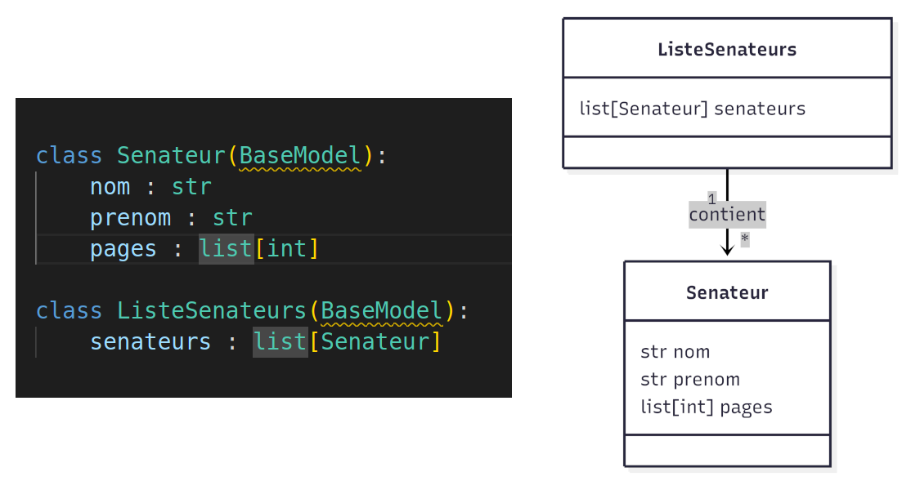
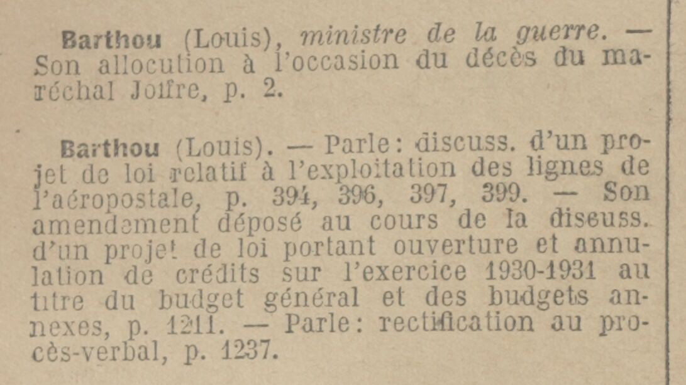
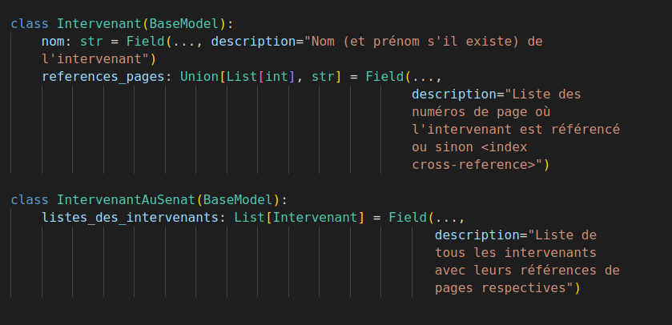
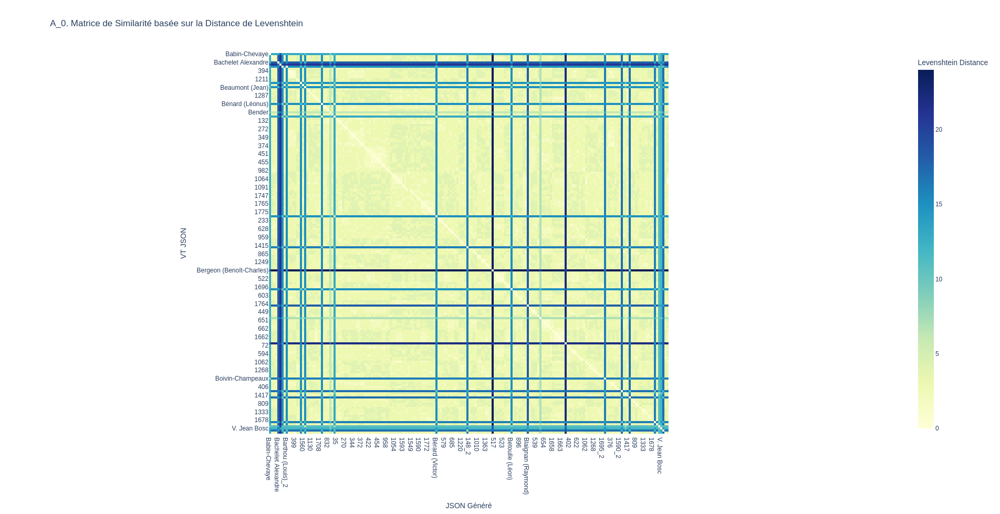
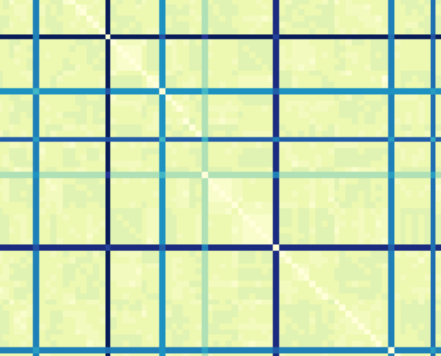
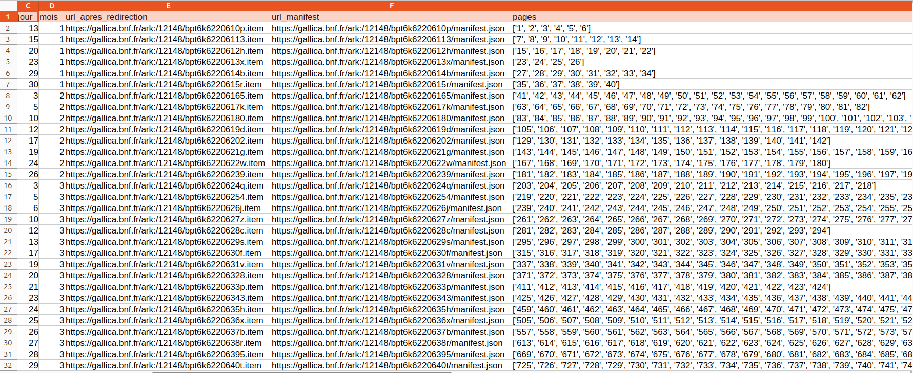

# L'outil Corpusense : une chaîne de traitement pour les sources historiques

L’outil *Corpusense* du projet Mezanno a pour ambition de proposer aux chercheurs et chercheuses en sciences humaines et sociales un dispositif dédié à l’exploitation de corpus d’archives sérielles. Là où la partie précédente du mémoire a montré la diversité des enjeux liés à la numérisation et à la mise à disposition de ces sources — qualité imparfaite de l’OCR, absence de structuration exploitable dans les textes bruts, masse de données qui rend toute saisie manuelle irréaliste — *Corpusense* vise à apporter une réponse technique réaliste. "Réaliste", car il s’appuie pour cela sur des briques logicielles déjà disponibles et rapides à mettre en place, qu’il agence en une chaîne cohérente correspondant au schème opératoire transcriptif défini précédemment, allant de la source numérisée à la donnée structurée.

Le fonctionnement de *Corpusense* repose principalement sur l’usage d’**API**, c’est-à-dire d’interfaces de programmation qui permettent à des logiciels hétérogènes de communiquer entre eux en suivant un protocole défini. Les API fonctionnent comme des guichets d'information qui délivrent, selon les requêtes, des données demandées, par exemple une série d'images et leurs métadonnées dans le cas de **IIIF**. Plutôt que de réimplémenter des modules complexes, l’outil tire parti de services spécialisés en les appelant directement via leurs API. Trois d’entre elles structurent le dispositif : IIIF, donc, qui est le standard largement adopté par les institutions patrimoniales, qui permet de charger et manipuler des images numérisées de manière normalisée. La constitution de corpus se fait donc à partir des dépôts d'archives numérisées, en général par des institutions patrimoniales. Il faut compter également une "APIsation" du moteur **Pero OCR** par l'EPITA; qui fournit comme on l'a vu une reconnaissance optique des caractères adaptée aux corpus historiques et multilingues. Et, enfin, l’API de **Mistral**, un modèle de langage, mobilisée pour transformer les textes OCRisés en sorties structurées adaptées aux besoins des chercheurs (voir @corpusense). Ainsi, il s'agit de reconstituer une chaîne opératoire, composé de différentes briques agencées et constituées en outil.

L'outil motive donc une double orientation. D’une part, il repose sur une chaîne de traitement unifiée, pensée pour transformer des documents d’archives sous forme image en données structurées, interopérables et prêtes à être analysées. D’autre part, il se veut flexible et accessible, de façon à laisser aux chercheurs SHS une autonomie réelle dans la conduite de leurs travaux. Concrètement, une application Web comme *Corpusense* permet de constituer des corpus documentaires à partir de dépôts variés d’archives numérisées et d’y appliquer, sans compétences techniques avancées, des traitements qui aboutissent à des données exploitables.

## Une instance de pipeline "classique"

L’objectif de Corpusense veut fournir une infrastructure technique robuste pour solidariser les différents rouages (à savoir la constitution des corpus, OCR, extraction) @pipieline_mezz.

La chaîne de traitement se déploie en plusieurs étapes successives. Tout d'abord, la sélection et organisation des sources. Le point de départ réside dans la constitution du corpus. Celui-ci peut provenir de fonds institutionnels (par exemple Gallica, la BnF ou des archives universitaires), ou de collections numérisées indépendantes. Les documents, le plus souvent disponibles sous forme d’images, sont alors recensés et organisés dans un format exploitable. Dans ce contexte, *Corpusense* s’appuie sur le protocole IIIF, largement adopté dans le domaine patrimonial. IIIF permet non seulement d’accéder aux images numérisées de manière normalisée, mais aussi de les manipuler (zoomer, rogner, annoter) et de les intégrer de façon homogène, quelle que soit l’institution d’origine. Ce recours à un standard interopérable assure la portabilité des corpus et facilite leur exploitation au-delà du cadre spécifique de ce projet. 

Ensuite, la transcription par OCR. La deuxième étape consiste à convertir ces images en texte grâce à un moteur de reconnaissance optique de caractères (OCR). Corpusense s’appuie principalement sur le moteur PERO OCR. 

Enfin, la sortie structurée (avec l'API Mistral), laquelle produit un document en JSON, qui peut d'ailleurs être converti aisément en format CSV.

Le choix du format JSON pour représenter les données structurées ne relève pas seulement de la contrainte imposée par l’API Mistral même si cette disponibilité oriente un tel choix. Ce format présente en fait plusieurs avantages décisifs dans le cadre d’un outil comme *Corpusense*. D’un point de vue technique, JSON est un standard commun pour l’échange de données : léger, lisible par l’humain, directement exploitable par la plupart des langages de programmation et facilement convertible en d’autres formats, qu’il s’agisse de tables ou de bases de données relationnelles ou documentaires. Cette plasticité garantit la réutilisation des résultats, quel que soit l’environnement de recherche dans lequel ils sont ensuite mobilisés. L’intérêt du JSON réside dans l'implémentation de la dialectique clé/valeur, laquelle se prête particulièrement bien à des tâches "indexatoires", davantage convenante à la logique tabulaire, plus rigide. Là où un tableau, par exemple au format CSV, oblige à « aplatir » l’information, JSON permet de conserver les relations entre entités (par exemple entre un intervenant et les différentes pages où il est cité) et d’accueillir des variations de granularité sans perdre la cohérence du tout. Par exemple, chaque sénateur peut intervenir un certain nombre de fois : en JSON, chaque référence d'intervention est un élément manipulable, distinct des autres; et l'ensemble de ces références est une liste de taille variable. Dans un tableau, on pourrait soit agréger ces différentes références dans une unique colonne séparés avec un séparateur arbitraire @comparaison -- impliquant alors de parser *a posteriori* ces séries de nombres -- ou bien, mais c'est ici une option assez malheureuse, de constituer autant de colonnes que d'interventions. La séparation des valeurs en JSON fait partie de sa grammaire quand, côté tables, la séparation de valeurs numériques est en fait une chaînes de caractères qu'il faut "spliter" pour retomber sur une certaine modularité.

Il est ainsi possible de représenter des cas simples ou complexes au sein d’un même corpus, ce qui correspond mieux à la réalité hétérogène des archives numérisées. A ce stade, on remarque une difficulté pour l'historien qui mobilise des données structurées. Dans une démarche outillée, par exemple avec l'outil *Corpusense*, elle résiderait peut-être moins dans la capacité à programmer qu'à envisager la forme des données, qu'à modéliser un problème ou un ensemble de faits. Cet exercice n’est pas trivial : veut-on décrire des entités et leurs attributs, suivre leur activité dans le temps, ou cartographier leurs relations ? Chacun de ces choix renvoie à des modèles de données distincts, et donc à des manières différentes de faire parler les sources. L'outil ne fait pas disparaître les problématiques de modélisation des données. On retrouve ici la notion de *valuation* au sens deweyien : les moyens de l’enquête — ici, la forme des données et les dispositifs techniques qui les produisent — dépendent des fins poursuivies, mais ces fins elles-mêmes ne sont jamais figées. Elles peuvent être révisées, ajustées ou enrichies au fil des expérimentations, en fonction de ce que les données rendent possible ou non. En ce sens, modéliser les données revient parfois à réactiver, au présent, des gestes interprétatifs analogues à ceux que Collingwood décrivait sous le terme de *reenactment* : l’historien ne fait pas que collecter des informations, il rejoue l’acte de pensée, reconstruit les problèmes tels qu’ils se posaient aux acteurs du passé, mais à travers des médiations techniques. L’historien n’a donc pas affaire à une simple « conversion numérique » de sa pratique, mais bien à une reconfiguration de ses schèmes interprétatifs sous l’effet des opérations techniques. Dans cette perspective, parler de « numérisation du métier d’historien » [@poublanc] ne désigne pas seulement une facilitation instrumentale par les outils numériques : cela renvoie à l’intégration de nouveaux schèmes techniques dans l’enquête elle-même, qui orientent la manière de modéliser les mots et les faits. L’historien ne saurait être l'aliéné des dispositifs techniques — au sens où Simondon entend l’aliénation comme l’usage aveugle d’outils méconnus — mais participe au contraire à leur individuation, en les inscrivant consciemment dans son milieu de recherche et dans ses gestes interprétatifs. 

De plus, cette solidarisation des différentes briques techniques — de cette médiation technique pour constituer des questions et des réponses — ne fait pas disparaître la question de l’évaluation des données produites. Au contraire, elle la rend plus pressante. Car exploiter scientifiquement des données issues d’un assemblage *abstrait* de techniques *concrètes* — pour reprendre le vocabulaire de Gilbert Simondon — suppose de fonder une confiance raisonnée : confiance dans les outils choisis, dans la cohérence de la chaîne opératoire, mais aussi dans la capacité des chercheurs à expliciter les conditions de production des données qui alimentent leur analyse. Dans le cas d’une pipeline comme *Corpusense*, on a affaire à un tel assemblage abstrait : une juxtaposition de fonctions spécialisées (OCR, segmentation, structuration), qui ne forment pas encore un objet intégré mais dont la coopération doit être évaluée comme un tout. Ce qui permet de fonder cette confiance est donc l’*évaluation* de la chaîne de traitement, c’est-à-dire à la fois la performance de chaque module et la cohérence globale de l’ensemble.

## Le travail sur Corpusense

Au moment du stage, *Corpusense* était encore en cours de développement; toutes les fonctionnalités n'étaient pas encore disponibles. Je l’ai donc utilisé principalement pour la constitution du corpus, l’OCRisation et le téléchargement du texte issu de la *Table nominale* de 1931. En revanche, pour la génération de la sortie structurée à l’aide de l’API Mistral, je travaillais directement depuis mon ordinateur, en effectuant les appels manuellement. Cette fonctionnalité est aujourd’hui intégrée dans *Corpusense*, mais elle ne l’était pas encore au moment de mes expérimentations.

Ce décalage n’affecte pas la validité des travaux réalisés : les modules sollicités -- notamment Mistral pour la production JSON -- sont identiques, seul le mode d’appel diffère. Les expérimentations sur la structuration des données ont donc été conduites à partir du texte brut, en dehors de l’application, mais elles prolongent directement le schème opératoire mis en place par *Corpusense*.

## Ateliers à l'EHESS et à la BnF

Avant de passer à l’évaluation proprement dite, arrêtons-nous sur un cas concret qui illustre bien les difficultés rencontrées. Lors d’un atelier mené à l'EHESS par les développeurs de *Corpusense*, une chercheuse — sans formation particulière en informatique — a expérimenté l’outil sur un corpus de la Quatrième République. En une demi-heure, elle a pu obtenir un jeu de données massif, comprenant plus de 1200 entités liées à l’activité parlementaire, plus précisemment sur la production de documents parlementaires. L’exercice montre à quel point la chaîne de traitement peut être efficace et accessible : un travail qui aurait pris des semaines en dépouillement manuel est désormais réalisable en un temps réduit. 

Cependant cette réussite apparente masque plusieurs écueils. La chercheuse, tâche peu facile oblige, a eu du mal à définir précisément son modèle de données : quelles entités retenir ? quelles relations considérer comme pertinentes ? quelle granularité adopter ? Faut-il penser en terme d'acteurs ? De documents produits ? Il a fallu essayer différents modèles pour obtenir un résultat satisfaisant ; redéfinir clairement ce que l'on tenait à savoir sur la période étudiée. On pourrait, en reprenant le mot de Leroy Ladurie, l'historien a tout intérêt à être *designer* -- plutôt d'ailleurs que "programmeur" -- car l'enjeu est d'être capable de modéliser des données. De plus, même si la structuration a fonctionné, la question centrale reste ouverte : les données ainsi produites sont-elles fiables ? Dans quelle mesure peut-on leur faire confiance pour alimenter une enquête historique, et non seulement une démonstration technique ? A l'issue de cet atelier, qui visait avant tout à expérimenter l'outil qu'à produire de véritables données pour une question de recherche déterminée, le besoin de savoir si les données était fiables était urgent : ainsi, par ce cas exemplaire qui ne fait qu'illustrer une problématique qui a fondé les tenants et aboutissants du stage, la grande question de l'*évaluation* et de la confiance que l'on peut porter aux données.

# La sortie structurée via LLM appliquée à la Table des Noms du Sénat : une approche empirique

La pertinence scientifique des analyses repose sur l'évaluation qui ne se réduit pas à un simple contrôle technique. Elle engage une véritable réflexion méthodologique. Dans le cadre du stage, cette réflexion méthodologique s'est adossée à l’expérimentation sur la façon d'évaluer des données, générées par la pipeline. Evaluation et expérimention peut sembler antinomiques. Par évaluation, on entend une dimension scientifique, protocolaire. La notion de "créativité" que motive au fond celle d'expérimentation et sa dialectique de l'essai-erreur, ne semble pas de mise. Pourtant, la question de la métrique à laquelle s'adosse l'évaluation ne va pas de soi : car il faut évaluer à la fois l'indexation du contenu par le système technique; mais également sa structure de façon conjointe. Il faut également pouvoir apprécier les abscences, les hallucinations; éventuellement, les différentes façons d'OCRiser le texte, tester si un OCR réputé parfait conduit à des résultats finalement très proches de données très imparfaites. De plus, l'évaluation s'adosse à des *vérités terrain* qui, comme on l'a vu pour l'OCR, forment un domaine de référence sur laquelle quantifier les écarts avec la génération du LLM. Ces vérités terrain, qui permettent de fonder une analyse permettant d'émuler l'objectivité, sont pourtant le fruit de décisions qui ne sont pas évidentes : comment nommer ses métadonnées, quelle structure -- ou *schéma* -- conviendrait le mieux à nos données ? La modélisation, comme on vient de le voir également est une véritable affaire de design. Il y a donc un arsenal de paramètres à prendre en compte. Pour arrêter un protocole d'évaluation, il faut dégager des critères de façon empirique -- et donc expérimenter et réduire les paramètres selon ce qu'il semble le plus pertinent. Le mot de Gaston Bachelard selon lequel les instruments seraient de la "théorie réifiée" est particulièrement approprié à notre cas, car les moyens pour mesurer la qualité des données produites par la pipeline dépend de nos valuations. Cette évaluation prend sens dans un processus itératif où techniques et de valeurs amendées par l'expérimentation et par les objectifs fixés par une question de recherche.

Bien évidemment, cette expérimentation-évaluation s'adosse, non pas à une problématique technique pure, mais à une question de recherche en histoire -- bien qu'elle soit un motif pour guider l'exploration documentaire et computationnelle --, à savoir : cartographier l'activité parlementaire pour l'année 1931, conformément au *reeanctement* collingwoodien suggéré en première partie de ce mémoire sur la qualité du débat parlementaire. Cette motivation historienne, en quatre mois seulement, ne saurait être mené de bout en bout. L'enjeu est donc de maîtriser et évaluer le protocole d'extraction; de tester sa complexité et vérifier qu'il est satisfaisant à ce stade, avant de mener des projets plus ambitieux.

## Expérimentations

### Prise en main intuitive du problème de la génération de données

L’expérimentation menée s’est organisée autour de deux volets complémentaires : d’une part, la génération de données à partir des *Tables* parlementaires proprement dite; et, d’autre part, leur évaluation à l’aune d’une vérité terrain soigneusement construite.

Dans un premier temps, le travail a consisté en une phase d’exploration technique visant à s’approprier la tâche d’évaluation des sorties structurées produites par un modèle génératif. L’objectif principal était de vérifier la faisabilité d’une extraction fiable des informations essentielles : les noms des intervenants au Sénat (qu’il s’agisse de sénateurs ou de ministres interpellés) et les dates de leurs interventions.

Ces dates ne figurent pas explicitement dans les *Tables* ; elles doivent être déduites par le biais des références de page, lesquelles constituent des indicateurs temporels indirects. En d’autres termes, la pagination continue du *Journal Officiel* rend possible un fléchage des interventions dans le temps, en reliant chaque entrée des tables à la séance correspondante comme on le verra en temps venu.

Pour produire les données structurées, plusieurs pistes ont été explorées. La plus immédiate a été de recourir à des prompts « naturels » en utilisant directement l'interface Web de Mistral, laissant au modèle une certaine liberté interprétative dans sa réponse. 

L'extraction d'une réponse dans l'environnement d'un chat résiste à l'extraction systématique, notamment parce qu'elle est entourée de politesses qui se surajoutent à l'information  qui nous intéresse -- ici la liste des sénateurs @mistral . Mais également parce que cette réponse est émise dans un environnement -- en ligne -- qu'il est difficile à intégrer dans une pipeline. Les appels à l'API Mistral permettent donc à la fois d'interroger un LLM comme on l'a fait, mais depuis un script qui peut récupérer les données, les sauvegarder en local, d'appliquer divers traitements.

Ce qui nous permet désormais de justifier l’usage de Mistral : l’appel à l’API était gratuit, sans restrictions, et supportait la génération par sortie structurée -- c’est-à-dire la capacité de contraindre le modèle à suivre un schéma formel représentant nos données. Autrement dit, on peut utiliser, sans aucune installation ou dépense, un LLM pouvant être "contraint" à formuler du JSON -- et rien que du JSON -- par un schéma formels afin de produire des objets comparables. De fait, ce schéma @modelepy était produit avec la librairie Pydantic qui permet de convertir des classes Python qui représentent le schéma de données, en modèle JSON.

Mais un schéma, à lui seul, ne suffit pas : il doit être combiné à un prompt qui guide le modèle. Le tout premier essai reposait sur des instructions très simples :

> « Extrayez les informations du texte fourni. Je veux la liste des noms et prénoms de toutes les personnes mentionnées (des sénateurs). »  
> « Attention au bruit : tout ce qu’il y a dans le texte n’est pas forcément un sénateur. »  
> « Voici mon texte : »

Ces instructions rudimentaires avaient pour objectif principal de vérifier le bon fonctionnement de l’appel à l’API et le retour des données dans le format JSON. En pratique, le pipeline consistait en un script Python qui, à partir du texte OCRisé, soumettait au modèle Mistral un prompt et un schéma, puis récupérait les données produites [@pipeline_mezz].

Toutefois, dès les premiers tests, des limites sont apparues : les clés choisies dans le modèle, comme *ListeSenateur* ou *Senateur*, étaient trop restrictives. Or, les *Tables nominatives* ne mentionnent pas seulement des sénateurs, mais également des ministres interpellés ou intervenants extérieurs. Un schéma trop strict risquait donc d’induire des omissions. Pour contourner ce problème, il a été décidé d’adopter un vocabulaire plus fonctionnel, centré sur les *intervenants* plutôt que sur une fonction institutionnelle définie de façon explicite. Une fois cette chaîne de traitement permettant de produire des données essayée, il était l'heure de consolider un protocole d'évaluation de cette méthode de génération de métadonnées.

### Design, prompt et vérité terrain : trouver le bon modèle de données

Un second volet des expérimentations a porté sur la construction de la vérité terrain, élément indispensable à toute évaluation. En théorie, elle sert de référence absolue pour mesurer les performances du modèle. En pratique, elle résulte d’une série de décisions éditoriales et méthodologiques qui influencent directement les résultats. L’exemple de Louis Barthou, sénateur et ministre de la Guerre en 1931, illustre ce point : fallait-il regrouper toutes ses interventions sous une seule entrée ou distinguer ses apparitions selon ses fonctions @barthou  ? Le choix de la granularité maximale – séparer chaque occurrence – prévient les confusions d’homonymes, mais complique l’évaluation en raison de la tendance du modèle à fusionner les mentions.

Sur le plan technique, la vérité terrain est lié au prompt et au schéma de données (@modelpy). Le schéma de données fait office de "carte" qui vient guider la production textuelle du LLM. Il indique "où" mettre les bons mots dans les bonnes boîtes, les bons intitulés avec les bonnes clés. Pour éviter de démultiplier les paramètres à tester, le prompt (voir : ANNEXE 31) et le schéma (ANNEXE 32) ont été stabilisés à l'issu d'un processus itératif pour évaluer la granularité adéquat. Dans le cadre de l'évaluation, seul le nom du sénateur et les pages de références ont été retenues. Pour guider au mieux la génération du JSON par le LLM, on ajoute à notre schéma des descriptions pour qu'il puisse être plus attentif pour qu'il puisse plus facilement mettre les données dans les bonnes boîtes @model.

Le schéma (@model) joue donc ici le rôle de grammaire opérationnelle : il décrit précisément la structure attendue des sorties (nom, rôle et références paginaires des intervenants), et contraint le modèle à produire un JSON validable. Les premières clés (« Senateur », « ListeSenateur ») ont rapidement montré leurs limites : elles risquaient l'invisibilité d’autres acteurs -- comme les ministres -- et biaisaient l’extraction. La version finale de la vérité terrain (ANNEXE 33) adopte des catégories plus neutres (« Intervenant »), révélant que la modélisation n’est jamais un simple exercice technique mais un choix interprétatif.

Quant aux données produites automatiquement par cette chaîne de traitement stabilisées et appliquées sur l'ensemble des pages des *Tables* du Sénat de 1931 (extraits en annexe : ANNEXE 34) , elles semblent être cohérentes. Mais, à défaut d'évaluation, on ne pas tirer de conclusion décisives.

### Préparer l'évaluation : comparer, apparier

L’évaluation des sorties structurées générées par un LLM reposant sur un schéma, un prompt repose donc sur une comparaison systématique entre deux ensembles : la vérité terrain construite manuellement comme référence, et les données produites automatiquement par le modèle. L’objectif est maintenant de mesurer objectivement la fidélité de la génération, d’identifier les omissions, duplications ou erreurs, et d’évaluer la robustesse globale du système. Lors de la phase exploratoire autour de l'évaluation, plusieurs approches méthodologiques et outils de comparaison ont été expérimentés afin de prendre en main les méthodes classiques de mesure de similarité et identifier des indicateurs adaptés à l’évaluation qualitative de données produites par un modèle génératif. 

Comparer une vérité terrain soigneusement construite avec des données générées par un modèle de sortie structurée ne se résume pas à vérifier la présence ou l’absence d’éléments identiques. Plusieurs sources de divergences compliquent l’évaluation : des nœuds peuvent être omis, inventés ou dupliqués ; des erreurs d’OCR altèrent le texte ; des éléments sont regroupés ou mal hiérarchisés dans la structure JSON. La comparaison doit donc dépasser une logique purement textuelle pour capturer ces écarts dans toute leur complexité, tout en restant robuste et interprétable. La comparaison n'est pas un simple "face à face" entre des données réputées parfaites et des données générées. L'expérimentation a permis de mettre en lumière certaines méthodes -- et d'en rejeter d'autres comme la *Tree Edit Distance*, davantage basée sur la structure des données que leur contenu.

La première étape a consisté à expérimenter la comparaison chaque élément textuel de la vérité terrain avec chaque élément généré, ce qui conduit à aplatir temporairement la structure JSON pour se concentrer sur le contenu. La distance de Levenshtein a été privilégiée, car elle mesure simplement le coût minimal d’édition (insertion, suppression, substitution) entre deux chaînes de caractères ; elle est donc adaptée pour évaluer des données issues d’un pipeline OCR + LLM, où les erreurs sont souvent lexicales plutôt que conceptuelles. Concrètement, ces distances ont été organisées en une *matrice de similarité* (@matricesim), dans laquelle chaque cellule représente le coût de transformation d’un élément de la vérité terrain en un élément généré. 

Ce dispositif visuel met en évidence des phénomènes difficiles à saisir autrement : comme les décalages -- des zones sombres signalent des omissions ou des décalages d’alignement, le modèle ayant « perdu le fil » avant de se resynchroniser -- et les regroupements -- des correspondances multiples sur une même ligne indiquent que plusieurs éléments ont été agrégés dans une seule entrée.

L’observation de ces matrices ont d'ailleurs conduit, à la marge, à une réflexion plus conceptuelle. En effet, ces matrices ne forment pas toujours un espace métrique au sens strict, car des propriétés comme l’inégalité triangulaire peuvent être bafouées -- autrement dit, l'ensemble des distances peuvent dessiner un paysage impossible où il n'y a pas de cohérence avec les distances. Pourtant, on observe des zones de cohérence locale qui respectent suffisamment ces propriétés pour fonctionner comme des espaces métriques restreints. Là où il y a émergence de propriétés métriques, il y a l'hypothèse d'une correspondance entre la vérité terrain et les données générées. Deux ensembles identiques comparés forment un espace métrique : on pourrait alors calculer "l'effort" d'une matricité de similarité pour devenir un véritable espace métrique. Encore une fois, il s'agit d'une réflexion marginale qui n'a pas été développée ensuite. Cependant, cela permet de mettre en avant certains garde-fous dans le cadre de l'évaluation, à savoir le respect de certaines propriétés mathématiques liées à la mesure.

Ensuite reste l'étape de la comparaison proprement dite. Comment mettre correspondance les bonnes paires ? Comment comparer toutes les entrées de la vérité terrain avec celles générées ? Si la matrice de similarité représente toutes les relations entre les vérités terrain et les données générées, c'est une cartographie relationnelle qui ne nous permet pas d'apparier les ensembles en vue d'évaluer la qualité des prédictions; elle ne dit pas comment assembler nos entrées. De même, à cause des desynchronisation, il faut pouvoir aller comparer des éléments qui ne sont pas nécessairement "en-face", c'est-à-dire qui ne partage pas le même rang.

Pour ce travail de mise en correspondance, intervient le transport optimal. Introduit par Gaspard Monge en 1781 -- dans son *Mémoire sur la théorie des déblais et remblais* -- et reformulé par l'économiste soviétique Leonid Kantorovitch en 1942, le transport optimal vise à trouver la correspondance la plus économique entre deux ensembles : ici, les éléments de la vérité terrain et ceux générés. Plutôt que de tester toutes les permutations possibles, dont le nombre croît de manière factorielle, le transport optimal représente le problème sous forme d’une matrice de coût -- qui ici peut nous être donnée à partir de la matrice de similarité -- et cherche à minimiser la somme des coûts d’appariement. Cette méthode permet donc d’obtenir un alignement global optimal, même lorsque les ensembles ont des tailles différentes; de détecter les correspondances « justifiées » au sens du coût minimal, tout en identifiant les zones où la correspondance est faible ou artificielle; de dépasser une logique purement séquentielle pour analyser la distribution globale des erreurs et omissions. Notre coût, ici, ce sont les "coûts d'édition" autrement dit nos distances de Levenstein, exprimée par la matrice de similarité.

Cette approche est intéressante pour documenter l’état des sorties générées : elle ne prétend pas résoudre les problèmes d’ordre ou de sémantique, par exemple, apparier « sénateur » et « parlementaire » demanderait des distances sémantiques -- bien que c'est une piste envisageable avec les *embeddings* dans le cas d'une analyse thématique des interventions parlementaires. En revanche, elle fournit une mesure robuste de dissemblance structurelle que nous offre justement le paysage des distances de Levenstein.En pratique, les vérifications manuelles réalisées sur de petits ensembles de données ont confirmé que les appariements identifiaient correctement les correspondances : chaque élément de la vérité terrain était relié à son équivalent prédit par le modèle. Ces tests ont permis d’esquisser un protocole d’évaluation fiable, en ancrant l’intuition dans des outils mathématiques et informatiques éprouvés.

Il ne s’agit cependant pas d’une démarche inédite : elle transpose à l’analyse des textes structurés un principe ancien et solide de l’évaluation de segmentation en vision par ordinateur. Comme l’explique Chazalon et Carlinet [@chazalon] à propos de la segmentation panoptique de cartes historiques, il est à la fois possible et pertinent de reformuler l’appariement des régions segmentées — contenus visuels — via un cadre bipartite, d’utiliser des métriques classiques (précision, rappel, F-score) [@chazalon]. Appliquée à nos données textuelles, cette approche inspire l’idée que l’appariement entre vérité terrain et données générées ne repose pas seulement sur le calcul statistique, mais peut aussi être qualifié, visualisé et interprété selon des logiques proches de celles de l’image numérique. En tout cas, une phase de l'expérimentation a consisté à comprendre la nature du transport optimal -- notamment avec les travaux de Gabriel Peyré [@peyre] -- afin d'en saisir les limites -- l'appariement ne regarde pas le sens des mots et ne prend pas compte de l'aspect séquentielle des entrées -- et les avantages -- permet justement de surmonter le problème des oublis et de faire correspondre des données qui ne sont pas "en face". Cela impliquant ainsi d'intégrer *a posteriori*, dans les métriques qui rendent compte de la qualité des données générées également la qualité de l'appariement.

Toutefois, ces expérimentations mettent également en évidence la dimension heuristique de cette démarche : les résultats dépendent autant du choix des mesures de similarité (distance de Levenshtein) que de la stratégie d’appariement retenue (transport optimal), ce qui engage une réflexion critique sur le design même de l’évaluation. Ainsi, même si la méthode hérite de protocoles éprouvés de l’imagerie, son adaptation à un contexte textuel demande des choix méthodologiques soigneux et explicités.

## Recouper des données pour l'analyse historienne

Dans une perspective historienne, la capacité à naviguer dans les volumes du *Journal officiel* ne repose pas uniquement sur la qualité des extractions textuelles, mais sur le recoupement systématique des données. L’enjeu est de relier des références issues des tables — ici limitées à des numéros de pages et aux occurences nominales — à des dates précises de publication, condition essentielle pour contextualiser les débats ou décisions mentionnés. Pour ce faire, nous avons exploité les manifests IIIF fournis par l’API Gallica, qui décrivent chaque volume sous forme d’une structure hiérarchisée : chaque page est identifiée, ordonnée et associée à une URL stable. Ce cadre technique permet de reconstituer un tableau complet "page → date", en combinant l’ordre des pages du manifeste avec les métadonnées des volumes et les dates présentes sur les pages de titre. Cette opération ne vise pas à créer un modèle sophistiqué de reconnaissance ou d’indexation, mais plutôt à bâtir un pivot de référence déterministe pour toute analyse ultérieure : il devient possible de passer d’une citation brute (une page) à son contexte temporel exact. 

Il est important de souligner qu'à ce stade, cette correspondance se fonde sur les pages extraites par le système et rien n'indique que cette extraction repose sur des données fiables. Si ces données, à défaut d'évaluation, ne sont pas exploitables scientifiquement pour répondre à une question de recherche, il est cependant convenable de vérifier qu'on peut, à partir d'elles, avoir des informations plus intéressantes que des références de pages, comme des informations chronologiques.

### Des pages aux dates : utilisation de l'API Gallica et des métadonnées des manifestes

La constitution d’un tableau « page → date » s’appuie sur les services IIIF proposés par Gallica, qui fournissent pour chaque document numérisé un manifest JSON décrivant l’ensemble de ses pages. Ce *manifest* joue le rôle de table des matières numérique : il contient, pour chaque page, son ordre dans le volume, son libellé (numéro de page ou folio) et des identifiants pérennes vers l’image et le contenu OCRisé. La première étape consiste à interroger automatiquement cette ressource -- via des requêtes HTTP en lignes de commande, et notamment avec "curl" -- pour extraire la séquence complète des pages.

Ensuite, les pages sont indexées : chaque entrée du manifest est associée à son URL lisible et à son numéro de séquence. Cette structure séquentielle est cruciale, car elle fournit un pivot neutre pour relier des références issues d’autres sources (tables imprimées, index, etc.).

La seconde étape exploite les pages de titre qui portent la date d’édition. Ces informations, accessibles via l’API Gallica sont extraites puis assignées à des plages de pages contiguës : ainsi, toutes les pages comprises entre deux dates identifiées héritent de la date correspondante.

En combinant ces deux sources (manifest + extraction de dates), on construit une table de correspondance exhaustive reliant chaque page d’un volume à sa date exacte de parution. Cette table, exportée en CSV, sert ensuite de base à des analyses historiennes : une référence de page extraite d’un index thématique peut être immédiatement replacée dans son contexte temporel. L’approche, entièrement automatisable, repose sur des standards ouverts (IIIF, JSON, HTTP) et sur des outils simples de parsing et de jointure de données, ce qui garantit sa robustesse et sa réutilisabilité. (ANNEXE 34)

# Livrables

## Jeux de données pour le protocole d'évaluation de la sortie structurée

### Protocole d’évaluation de la sortie structurée

L’objectif de l’évaluation est de comparer les sorties produites par le LLM -- notées P, pour *prédiction* -- au *ground truth* -- la vérité terrain, notée G. Chaque instance de donnée correspond à une liste d’entrées, chacune constituée d’un nom d’orateur et d’une liste de pages référencées.

Un défi majeur, on l'a vu, tient au fait que le modèle peut produire le bon ensemble d’entrées, mais dans un ordre différent, ou avec de légères variations structurelles. Pour résoudre cela, nous adoptons une stratégie d’alignement flexible inspirée utilisant le transport optimal pour établir une correspondance *one-to-one* entre prédictions et référence. Cette approche neutralise la contrainte d’ordre et tolère des divergences mineures, permettant une évaluation robuste.

L'OCRisation est indépendante et en amont de la comparaison :

1. Chaque page image est d’abord traitée indépendamment par le moteur OCR PERO pour détecter et transcrire le texte.
2. Compte tenu des difficultés persistantes de segmentation de mise en page, nous produisons trois variantes de transcription par page afin de refléter la variabilité de ce type de pipeline : une OCRisation "brute", sans segmentation; une OCRisataion qui repose sur une segmentation manuelle; et une émulation d'une OCRisation réputée parfaite, fait à la main, qui correspond à la vérité terrain.

Dans nos expérimentations, pour des raisons pratiques, chaque page est traitée indépendamment, mais la méthode peut être étendue à des contextes multi-pages.

Bien que les LLMs puissent être incités à générer des sorties structurées, il est essentiel de contraindre leurs générations au format attendu. Parmi les méthodes existantes, la plus efficace repose sur le filtrage des tokens valides au moment de l’inférence à l’aide d’un validateur externe (par exemple un automate fini). Cette capacité est disponible dans certaines API commerciales étendues.

Notre processus d’extraction s’appuie donc sur :

- un texte prétraité par OCR,
- un schéma prédéfini (JSON),
- un prompt naturel,
- et une API supportant les sorties contraintes.

Pour cette étude, nous avons retenu l’API Mistral, avec le modèle *Ministral 8B Instruct v2410*, en raison de ses bonnes performances *zero-shot*, de son coût modéré et de la disponibilité publique de ses poids à des fins de recherche.

### Vérité terrain, prompt et schéma : un échantillon des Tables

A l'issue de la démarche d'expérimentation en vue de l'évaluation a été produit le design de vérité terrain, accompagné de son schéma et du prompt, qui sera comparées à l'information extraite par le LLM. La tâche d’extraction repose sur l’identification des entrées individuelles dans les *Tables nominatives* — c’est-à-dire les noms des sénateurs et leurs références de pages. (ANNEXE 33, 34)

Un échantillon aléatoire de cinq pages consécutives a été choisi pour transcription et annotation manuelles. Comme les entrées peuvent s’étendre sur plusieurs pages, certaines se retrouvent tronquées. Dans ces cas, le LLM a été explicitement instruit d’ignorer les éléments incomplets. Ce choix reflète les défis réalistes de l’extraction, où une prise en compte multi-pages (ou en flux continu) serait nécessaire en production, mais dépasse le cadre de cette étude.

L’évaluation porte sur l'ensemble $G$ comportant 109 entrées réparties sur cinq pages, chacune testée dans les trois conditions OCR, et représentées chacune par un JSON. 

### Prédictions obtenues avec le modèle Mistral 8b avec  l'extraction guidée par schéma

Pour l’année 1931, les *Tables des noms* du Sénat couvrent 14 pages et comptent environ 300 entrées, chacune correspondant à une intervention en assemblée. Chaque entrée est associée à un orateur et détaille différents types d’actions (demandes d’interpellation, discussions de projets de loi, lecture de rapports de commission, dépôt d’amendements, etc.), accompagnées d’une référence de page renvoyant à la transcription complète de l’intervention. L'ensemble des prédictions générées par le LLM sont au format JSON

## Une métrique pour l'évaluation des données générées par la sortie stucturée via LLM

### Mise en correspondance des prédictions et de la vérité terrain avec le transport optimal

Pour comparer les entrées prédites et de référence, nous définissons une distance normalisée \$d\_e(g\_i, p\_j)\$ qui combine deux composantes :

* **Nom de l’orateur (texte)** : distance de Ratcliff/Obershelp (basée sur la plus longue sous-chaîne commune), après minuscule et suppression des espaces. La distance normalisée \$d\_n(g\_i, p\_j) \in \[0,1]\$ vaut 0 pour un match exact et 1 pour une dissimilarité totale.

* **Pages référencées (ensembles)** : distance Intersection-over-Union (IoU) :

$$
d_p(g_i, p_j) = 1 - \frac{|ref\_pages(g_i) \cap ref\_pages(p_j)|}{|ref\_pages(g_i) \cup ref\_pages(p_j)|}
$$

* **Distance d’entrée** :

$$
d_e(g_i, p_j) = d_n(g_i, p_j) \times d_p(g_i, p_j)
$$

Un appariement *one-to-one* entre prédictions et vérité terrain est alors établi par transport optimal \[19], minimisant la distance totale et fournissant une base rigoureuse pour l’évaluation.

### Limites des métriques classiques : précision, rappel et F1

Les métriques usuelles (précision, rappel, F1) sont couramment utilisées pour évaluer les tâches d’extraction. Cependant, dans notre protocole, où les entrées sont alignées par transport optimal, elles deviennent trompeuses :

* l’appariement injectif force une correspondance complète, ce qui maximise artificiellement la précision,
* le rappel ne reflète pas les entrées manquantes ou ajoutées,
* la F1 hérite de ces biais et surestime les performances.

### Integrated Matching Quality (IMQ)

Pour dépasser ces limites, nous exploitons directement la distance \$d\_e\$ pour définir un score de qualité \$q\_i = 1 - d\_e(g\_i, p\_i)\$, qui reflète la proximité entre une entrée prédite et sa référence.

Plutôt que de fixer un seuil arbitraire pour décider du « bon » appariement, nous calculons la proportion de correspondances de qualité supérieure à un seuil \$t\$, puis intégrons sur tout l’intervalle $\[0,1]\$ :

$$
IMQ = \int_0^1 F(t) \, dt
$$

où \$F(t)\$ est la fraction des correspondances de qualité \$q\_i \geq t\$.

L’IMQ résume ainsi la qualité globale des appariements, récompensant à la fois leur nombre et leur proximité. Un score de 1 indique un alignement parfait. Cette métrique continue, indépendante de seuils arbitraires, est particulièrement adaptée aux sorties LLM, où de légères divergences sont fréquentes même sous fortes contraintes structurelles.

### Résultats et analyse

Nous avons appliqué notre méthode d’appariement sur cinq pages distinctes (109 entrées), chacune traitée indépendamment et présentant des qualités OCR variables. Le tableau ci-dessous présente les résultats pour chaque page OCRisée sans segmentation ni correction, avec les tailles des ensembles de référence et prédits, ainsi que le nombre de correspondances retenues par transport optimal :

| Source  | Précision (biaisée) | Rappel (biaisé) | IMQ    | Entrées de référence | Entrées prédites | Correspondances |
| ------- | ------------------- | --------------- | ------ | -------------------- | ---------------- | --------------- |
| page 02 | 1.0000              | 0.9565          | 0.9059 | 23                   | 22               | 22              |
| page 03 | 1.0000              | 1.0000          | 0.8928 | 25                   | 25               | 25              |
| page 04 | 1.0000              | 1.0000          | 0.9591 | 19                   | 19               | 19              |
| page 05 | 1.0000              | 1.0000          | 0.8636 | 19                   | 19               | 19              |
| page 10 | 1.0000              | 1.0000          | 0.8193 | 23                   | 23               | 23              |

Toutes les pages affichent une précision et un rappel « biaisés » parfaits ; mais comme discuté en section précédente, ces métriques sont limitées car elles découlent directement de l’appariement injectif. Elles ne reflètent pas la qualité réelle des alignements.

L’**IMQ**, en revanche, fournit une évaluation plus fine, en capturant la distribution des qualités de correspondances. Pour toutes les pages traitées, les scores IMQ restent élevés (entre 0.8193 et 0.9591), montrant une homogénéité forte entre correspondances. L’IMQ évalue donc à la fois la complétude et la proximité sémantico-syntaxique des appariements, jouant un rôle hybride entre rappel qualitatif et précision pondérée.

 Variations entre pages

* **Pages 5 et 10** : IMQ plus bas, lié à des incohérences typographiques. De nombreux prénoms n’y sont pas mis entre parenthèses après le nom, contrairement à l’attendu dans le *ground truth* (21 % des entrées sur la page 5, 39 % sur la page 10). Cela augmente artificiellement la distance textuelle et dégrade la qualité perçue des correspondances.

* **Page 3** : malgré une précision/rappel parfaits, IMQ plus faible (0.8928), dû à des problèmes OCR causés par un pli dans la reliure, générant du bruit visuel.

* **Page 2** : IMQ élevé (0.9059) malgré un rappel imparfait. Cela s’explique par un biais d’échantillonnage : le prompt avait été calibré sur cette page, ce qui améliore artificiellement la performance. Toutefois, les résultats solides sur la page 4 (IMQ = 0.9591) confirment la robustesse du dispositif.

Un cas particulier : sur la page 2, une personne est mentionnée deux fois (comme sénateur et comme ministre). Le *ground truth* distingue ces deux entrées, tandis que le LLM les fusionne. Cela réduit artificiellement le rappel mais correspond à une rationalisation fonctionnelle du modèle.

 Comparaison avec OCR « parfait »

Lorsque l’on compare avec l’OCR jugé « parfait » (corrigé manuellement), les résultats s’améliorent globalement :

| Source  | Précision (biaisée) | Rappel (biaisé) | IMQ    | Entrées de référence | Entrées prédites | Correspondances |
| ------- | ------------------- | --------------- | ------ | -------------------- | ---------------- | --------------- |
| page 02 | 1.0000              | 1.0000          | 0.9513 | 23                   | 23               | 23              |
| page 03 | 1.0000              | 1.0000          | 0.9430 | 25                   | 25               | 25              |
| page 04 | 1.0000              | 1.0000          | 0.9821 | 19                   | 19               | 19              |
| page 05 | 1.0000              | 1.0000          | 0.8778 | 19                   | 19               | 19              |
| page 10 | 1.0000              | 1.0000          | 0.8966 | 23                   | 23               | 23              |

Dans certains cas, les versions OCR bruitées donnent des résultats paradoxalement meilleurs. Par exemple, les en-têtes courants capturés par l’OCR bruité fournissent un contexte utile pour les entrées tronquées en début de page. Ainsi, sur la page 2, le LLM a correctement reproduit la double mention (sénateur/ministre), alors que l’OCR corrigé ne l’a pas permis.

Cela montre que la performance dépend non seulement du LLM, mais aussi de l’adéquation entre ses comportements et la conception du *ground truth*.

* Le prompt apparaît comme un paramètre critique : certains écarts ne sont pas liés au modèle, mais aux instructions données.
* Un schéma de granularité raisonnable, couplé à un prompt générique, permet d’obtenir des résultats fiables sans nécessiter une connaissance « atomique » des spécificités documentaires.
* L’analyse statistique page par page révèle des indices sur les exceptions structurelles internes aux documents (choix typographiques ou institutionnels), qui peuvent être significatives pour l’historien.

## Conclusion

Ce travail a exploré l’utilisation des grands modèles de langage pour la génération de données structurées à partir de sources historiques, à travers une étude de cas centrée sur les *Tables nominatives* du Sénat français de 1931. L’approche — combinant OCR, structuration guidée par schéma et génération contrainte via LLM — a produit des résultats évalués grâce à une métrique plus adaptée, l’**IMQ**, intégrée dans un protocole d’alignement optimal reliant données de référence et données prédites.

L’introduction de la métrique IMQ s’est révélée essentielle : elle permet d’évaluer la qualité de structuration au-delà des scores classiques de précision/rappel, inadéquats dans ce contexte.

Plusieurs pistes s’ouvrent pour renforcer la robustesse et la généralisation de l’approche :

* **Relier plus directement données extraites et questions de recherche** : il s’agit d’assurer que les hypothèses de réponse formulées à partir des données générées restent robustes dans le temps.
* **Évaluer le prompt lui-même** : cette étape reste à formaliser pour parvenir à un protocole d’évaluation véritablement complet.
* **Repenser la structuration de données** : elle ne doit pas être considérée comme un simple prétraitement neutre, mais comme un choix déterminant pour les analyses historiques possibles.

De ce point de vue, le prompt et le schéma de données apparaissent comme des **méta-paramètres** du système de production de données historiques. Leur génération et leur ajustement doivent être conçus comme faisant partie intégrante de la chaîne de traitement.

Une voie prometteuse consiste à **systématiser et automatiser ce processus de méta-optimisation**, afin de rendre ces approches reproductibles, transparentes et accessibles à des utilisateurs non spécialistes.

- Brown et al. → `[@brown]`

- [@purentimeus], [@poudra], [@lamasse], [@eugenedroitpol] [@saudrais] [@lemesle], [@bonnard] [@coniez] [@morel] [@prost] [@coniez]

- [@dirjo] [@jo1931] [@rygiel] [@gardey] [@boutier] [@comete] [@chazalon][@com][@comm]

- Chen et al. → `[@chen]`

- Clavert & Muller → `[@clavertmuller]`

- Devlin et al. → `[@devlin]`

- Finkel, Grenager & Manning → `[@finkelmanning]`

- Humphries et al. → `[@humphries]`

- Kirillov et al. → `[@kirillov]`

- Kišš, Beneš & Hradiš → `[@kisshradis]`

- Knutsen → `[@knutsen]`

- Kodym & Hradiš → `[@kodymhradis]`

- Kohút & Hradiš → `[@kohuthradis]`

- Kojima et al. → `[@kojima]`

- Liu et al. → `[@liu]`

- de Marneffe et al. → `[@marneffe]`

- Mintz et al. → `[@mintz]`

- Mistral AI → `[@mistralai]`

- Morel → `[@morel]`

- Nadeau & Sekine → `[@nadeausekine]`

- Peyré & Cuturi → ``

- Radford et al. (2018) → `[@radford2018]`

- Radford et al. (2019) → `[@radford2019]`

- Wei et al. → `[@wei]`

- Willard & Louf → `[@willardlouf]`

- Yuan & Sester → `[@yuansester]`

- Zhang & Shasha → `[@zhangshasha]`

- Zhao et al. → `[@zhao]`
