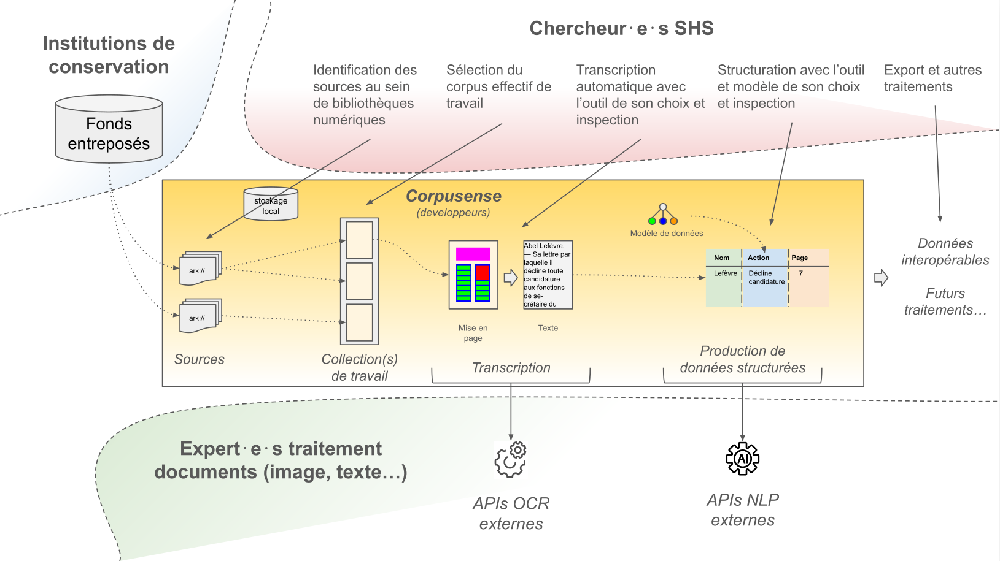
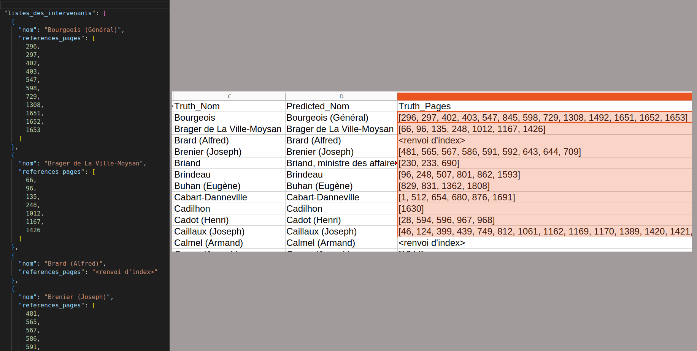

# L'outil Corpusense : une chaîne de traitement pour les sources historiques

L’outil *Corpusense* du projet Mezanno a pour ambition de proposer aux chercheurs et chercheuses en sciences humaines et sociales un dispositif dédié à l’exploitation de corpus d’archives sérielles. Là où la partie précédente du mémoire a montré la diversité des enjeux liés à la numérisation et à la mise à disposition de ces sources — qualité imparfaite de l’OCR, absence de structuration exploitable dans les textes bruts, masse de données qui rend toute saisie manuelle irréaliste — *Corpusense* vise à apporter une réponse technique réaliste. "Réaliste", car il s’appuie pour cela sur des briques logicielles déjà disponibles et rapides à mettre en place, qu’il agence en une chaîne cohérente correspondant au schème opératoire transcriptif défini précédemment, allant de la source numérisée à la donnée structurée.

Le fonctionnement de *Corpusense* repose principalement sur l’usage d’**API**, c’est-à-dire d’interfaces de programmation qui permettent à des logiciels hétérogènes de communiquer entre eux en suivant un protocole défini. Les API fonctionnent comme des guichets d'information qui délivrent, selon les requêtes, des données demandées, par exemple une série d'images et leurs métadonnées dans le cas de **IIIF**. Plutôt que de réimplémenter des modules complexes, l’outil tire parti de services spécialisés en les appelant directement via leurs API. Trois d’entre elles structurent le dispositif : IIIF, donc, qui est le standard largement adopté par les institutions patrimoniales, qui permet de charger et manipuler des images numérisées de manière normalisée. Il faut compter également une "APIsation" du moteur **Pero OCR** par l'EPITA; qui fournit comme on l'a vu une reconnaissance optique des caractères adaptée aux corpus historiques et multilingues. Et, enfin, l’API de **Mistral**, un modèle de langage, mobilisée pour transformer les textes OCRisés en sorties structurées adaptées aux besoins des chercheurs (voir @corpusense). Ainsi, il s'agit de reconstituer une chaîne opératoire, composé de différentes briques agencées et constituées en outil.

L'outil motive donc une double orientation. D’une part, il repose sur une chaîne de traitement unifiée, pensée pour transformer des documents d’archives sous forme image en données structurées, interopérables et prêtes à être analysées. D’autre part, il se veut flexible et accessible, de façon à laisser aux chercheurs SHS une autonomie réelle dans la conduite de leurs travaux.

## Une instance de pipeline "classique"

### L'implémentation du schème opératoire

L’objectif de Corpusense veut fournir une infrastructure technique robuste pour solidariser les différents rouages (à savoir la constitution des corpus, OCR, extraction) @pipieline_mezz.

La chaîne de traitement se déploie en plusieurs étapes successives. Tout d'abord, la sélection et organisation des sources. Le point de départ réside dans la constitution du corpus. Celui-ci peut provenir de fonds institutionnels (par exemple Gallica, la BnF ou des archives universitaires), ou de collections numérisées indépendantes. Les documents, le plus souvent disponibles sous forme d’images, sont alors recensés et organisés dans un format exploitable. Dans ce contexte, *Corpusense* s’appuie sur le protocole IIIF, largement adopté dans le domaine patrimonial. IIIF permet non seulement d’accéder aux images numérisées de manière normalisée, mais aussi de les manipuler (zoomer, rogner, annoter) et de les intégrer de façon homogène, quelle que soit l’institution d’origine. Ce recours à un standard interopérable assure la portabilité des corpus et facilite leur exploitation au-delà du cadre spécifique de ce projet. 

Ensuite, la transcription par OCR. La deuxième étape consiste à convertir ces images en texte grâce à un moteur de reconnaissance optique de caractères (OCR). Corpusense s’appuie principalement sur le moteur PERO OCR. 

Enfin, la sortie structurée (avec l'API Mistral), laquelle produit un document en JSON, qui peut d'ailleurs être converti aisément en format CSV.

Le choix du format JSON pour représenter les données structurées ne relève pas seulement de la contrainte imposée par l’API Mistral même si cette disponibilité oriente un tel choix. Ce format présente en fait plusieurs avantages décisifs dans le cadre d’un outil comme *Corpusense*. D’un point de vue technique, JSON est un standard commun pour l’échange de données : léger, lisible par l’humain, directement exploitable par la plupart des langages de programmation et facilement convertible en d’autres formats, qu’il s’agisse de tables ou de bases de données relationnelles ou documentaires. Cette plasticité garantit la réutilisation des résultats, quel que soit l’environnement de recherche dans lequel ils sont ensuite mobilisés. L’intérêt du JSON réside dans l'implémentation de la dialectique clé/valeur, laquelle se prête particulièrement bien à des tâches "indexatoires", davantage convenante à la logique tabulaire, plus rigide. Là où un tableau, par exemple au format CSV, oblige à « aplatir » l’information, JSON permet de conserver les relations entre entités (par exemple entre un intervenant et les différentes pages où il est cité) et d’accueillir des variations de granularité sans perdre la cohérence du tout. Par exemple, chaque sénateur peut intervenir un certain nombre de fois : en JSON, chaque référence d'intervention est un élément manipulable, distinct des autres; et l'ensemble de ces références est une liste de taille variable. Dans un tableau, on pourrait soit agréger ces différentes références dans une unique colonne séparés avec un séparateur arbitraire @comparaison -- impliquant alors de parser *a posteriori* ces séries de nombres -- ou bien, mais c'est ici une option assez malheureuse, de constituer autant de colonnes que d'interventions. La séparation des valeurs en JSON fait partie de sa grammaire quand, côté tables, la séparation de valeurs numériques est en fait une chaînes de caractères qu'il faut "spliter" pour retomber sur une certaine modularité.

Il est ainsi possible de représenter des cas simples ou complexes au sein d’un même corpus, ce qui correspond mieux à la réalité hétérogène des archives numérisées. A ce stade, on remarque une difficulté pour l'historien qui mobilise des données structurées. Dans une démarche outillée, par exemple avec l'outil *Corpusense*, elle résiderait peut-être moins dans la capacité à programmer qu'à envisager la forme des données, qu'à modéliser un problème ou un ensemble de faits. Cet exercice n’est pas trivial : veut-on décrire des entités et leurs attributs, suivre leur activité dans le temps, ou cartographier leurs relations ? Chacun de ces choix renvoie à des modèles de données distincts, et donc à des manières différentes de faire parler les sources. L'outil ne fait pas disparaître les problématiques de modélisation des données. On retrouve ici la notion de *valuation* au sens deweyien : les moyens de l’enquête — ici, la forme des données et les dispositifs techniques qui les produisent — dépendent des fins poursuivies, mais ces fins elles-mêmes ne sont jamais figées. Elles peuvent être révisées, ajustées ou enrichies au fil des expérimentations, en fonction de ce que les données rendent possible ou non. En ce sens, modéliser les données revient parfois à réactiver, au présent, des gestes interprétatifs analogues à ceux que Collingwood décrivait sous le terme de *reenactment* : l’historien ne fait pas que collecter des informations, il rejoue l’acte de pensée, reconstruit les problèmes tels qu’ils se posaient aux acteurs du passé, mais à travers des médiations techniques. L’historien n’a donc pas affaire à une simple « conversion numérique » de sa pratique, mais bien à une reconfiguration de ses schèmes interprétatifs sous l’effet des opérations techniques. Dans cette perspective, parler de « numérisation du métier d’historien » [@poublanc] ne désigne pas seulement une facilitation instrumentale par les outils numériques : cela renvoie à l’intégration de nouveaux schèmes techniques dans l’enquête elle-même, qui orientent la manière de modéliser les mots et les faits. L’historien ne saurait être l'aliéné des dispositifs techniques — au sens où Simondon entend l’aliénation comme l’usage aveugle d’outils méconnus — mais participe au contraire à leur individuation, en les inscrivant consciemment dans son milieu de recherche et dans ses gestes interprétatifs. 

De plus, cette solidarisation des différentes briques techniques — de cette médiation technique pour constituer des questions et des réponses — ne fait pas disparaître la question de l’évaluation des données produites. Au contraire, elle la rend plus pressante. Car exploiter scientifiquement des données issues d’un assemblage *abstrait* de techniques *concrètes* — pour reprendre le vocabulaire de Gilbert Simondon — suppose de fonder une confiance raisonnée : confiance dans les outils choisis, dans la cohérence de la chaîne opératoire, mais aussi dans la capacité des chercheurs à expliciter les conditions de production des données qui alimentent leur analyse. Dans le cas d’une pipeline comme *Corpusense*, on a affaire à un tel assemblage abstrait : une juxtaposition de fonctions spécialisées (OCR, segmentation, structuration), qui ne forment pas encore un objet intégré mais dont la coopération doit être évaluée comme un tout. Ce qui permet de fonder cette confiance est donc l’*évaluation* de la chaîne de traitement, c’est-à-dire à la fois la performance de chaque module et la cohérence globale de l’ensemble.

### Ateliers

Avant de passer à l’évaluation proprement dite, arrêtons-nous sur un cas concret qui illustre bien les difficultés rencontrées. Lors d’un atelier mené à l'EHESS par les développeurs de *Corpusense*, une chercheuse — sans formation particulière en informatique — a expérimenté l’outil sur un corpus de la Quatrième République. En une demi-heure, elle a pu obtenir un jeu de données massif, comprenant plus de 1200 entités liées à l’activité parlementaire, plus précisemment sur la production de documents parlementaires. L’exercice montre à quel point la chaîne de traitement peut être efficace et accessible : un travail qui aurait pris des semaines en dépouillement manuel est désormais réalisable en un temps réduit.

Mais cette réussite apparente masque plusieurs écueils. La chercheuse, tâche peu facile oblige, a eu du mal à définir précisément son modèle de données : quelles entités retenir ? quelles relations considérer comme pertinentes ? quelle granularité adopter ? Faut-il penser en terme d'acteurs ? De documents produits ? Il a fallu essayer différents modèles pour obtenir un résultat satisfaisant ; redéfinir clairement ce que l'on tenait à savoir sur la période étudiée. De plus, même si la structuration a fonctionné, la question centrale reste ouverte : les données ainsi produites sont-elles fiables ? Dans quelle mesure peut-on leur faire confiance pour alimenter une enquête historique, et non seulement une démonstration technique ? A l'issue de cet atelier, qui visait avant tout à expérimenter l'outil qu'à produire de véritables données pour une question de recherche déterminée, le besoin de savoir si les données était fiables était urgent.

# Expérimentations

La pertinence scientifique des analyses repose sur l'évaluation, qui ne se réduit pas à un simple contrôle technique mais engage une véritable réflexion méthodologique. Dans le cadre de mon stage, j’ai cherché à articuler trois dimensions souvent pensées séparément. L’expérimentation, d’abord, consiste à mettre à l’épreuve des solutions techniques sur des corpus réels, avec toute l’incertitude et la contingence que cela suppose. La valuation, ensuite, au sens pragmatiste que lui donne Dewey, désigne la formation progressive de valeurs et de critères de pertinence au fil de l’expérience. Enfin, l’évaluation, qui vient formaliser ces critères sous forme de métriques, permet de mesurer de manière transparente la qualité des résultats. Loin de s’opposer, ces trois démarches s’entrelacent : l’expérimentation nourrit la valuation en faisant émerger de nouveaux repères, la valuation oriente le choix des métriques pertinentes, et l’évaluation fournit en retour des points d’ancrage solides pour comparer et améliorer les pipelines. Ainsi, la question de la métrique ne va pas de soi : elle prend sens dans un processus itératif où techniques, valeurs et jugements scientifiques se co-construisent.

## Prise en main intuitive du problème

Le travail a commencé par une phase d’exploration technique, où l’enjeu était de s’approprier la tâche d’évaluation des sorties structurées produites par des modèles génératifs. Une fois la tâche définie — comparer une vérité terrain et les données générées — plusieurs pistes ont été testées. La plus immédiate consistait à employer des prompts « naturels », en laissant au modèle une certaine latitude d’interprétation, mais en les contraignant par des schémas formels afin de produire des objets comparables (par exemple en JSON). Dans un registre plus classique, des expressions régulières ont également été utilisées pour segmenter et contrôler les extractions. Ces premières expérimentations relevaient d’un bricolage méthodologique, fait d’essais et d’erreurs, mais elles ont permis de dégager des lignes de force.

En pratique, différents outils ont été mobilisés. Des bibliothèques Python comme TED (Tree Edit Distance) ou Donut ont offert un premier socle de comparaison structurelle des objets générés. En parallèle, la construction de matrices de similarité à partir de distances de type Levenshtein a permis de visualiser les écarts entre la vérité terrain et la sortie du modèle. L’inégalité triangulaire, au cœur de la définition d’un espace métrique, a ainsi servi de point de repère théorique : il s’agissait moins d’aboutir à une véritable métrique que de se doter d’un plan de comparaison, pour observer comment les données générées « se rapprochent » ou « s’éloignent » de la référence.

## Reflexions sur la notion de métrique à partir des matrice de similarité

Dans les prolongements des premières expérimentations, j’ai été conduit à explorer de manière plus spéculative le statut des matrices de similarité utilisées pour comparer vérité terrain et sorties générées. La méthode d’appariement par transport optimal, bien qu’efficace, n’épuise pas la question. En manipulant ces matrices, il est apparu qu’elles ne constituaient pas nécessairement des espaces métriques au sens strict, car les propriétés classiques de symétrie, de séparation et surtout d’inégalité triangulaire ne sont pas toujours vérifiées. Pourtant, l’intuition demeure qu’il existe localement des zones où la métricité « émerge », c’est-à-dire où les correspondances entre vérité terrain et données produites se cristallisent sous une forme qui ressemble à un espace métrique.

De cette intuition est née l’idée d’« archipels métriques ». Apparier deux ensembles distincts, c’est se confronter à un plan chaotique, où les correspondances sont partielles, bruitées, parfois trompeuses. Mais à l’intérieur de ce chaos, certaines régions se stabilisent : elles respectent suffisamment les critères de la métricité pour apparaître comme des sous-espaces cohérents. Chaque correspondance « réussie » se manifeste alors comme un îlot métrique, et l’ensemble des correspondances forme une sorte d’archipel. L’enjeu devient d’identifier ces zones stables, de les isoler et, peut-être, de mesurer le degré de relaxation nécessaire pour les faire apparaître.

Cette approche implique de considérer la matrice de similarité non seulement comme un outil de visualisation, mais aussi comme un espace à part entière, doté d’une géométrie implicite. L’inégalité triangulaire, par exemple, peut être relâchée pour tolérer le bruit et les erreurs propres aux données générées. Plus le relâchement requis est faible, plus l’appariement correspond à une structure métrique robuste ; inversement, un relâchement trop important signale que la correspondance est artificielle. On passe ainsi d’une logique de mesure stricte à une logique de tropisme : la qualité d’un match ne se réduit pas à un score, elle se comprend comme une tendance à former ou non un espace métrique.

Ces réflexions restent exploratoires et parfois naïves. Elles traduisent néanmoins une conviction : l’évaluation des sorties générées par des modèles ne consiste pas seulement à comparer des chaînes de caractères ou à aligner des structures JSON, mais à interroger les formes de cohérence qui émergent de ces alignements. La métaphore des archipels métriques permet de rendre sensible cette idée : dans un océan de dissemblances, il existe des zones de stabilité où les correspondances prennent consistance, et c’est dans ces zones que se joue la possibilité d’un appariement pertinent.

## Design et vérité terrain

Un autre axe d’expérimentation a concerné la construction de la vérité terrain elle-même. En théorie, celle-ci joue le rôle de référence absolue, garante de la « vérité » des données. En pratique, elle est le produit de choix opérés par le chercheur. Un exemple emblématique est celui de Louis Barthou, sénateur et ministre de la guerre en 1931 : fallait-il créer une seule entrée regroupant ses différentes interventions, ou distinguer ses apparitions selon ses rôles ? Dans mon cas, j’ai choisi la seconde option, au nom du principe de prudence : ne pas présupposer qu’il n’existe pas d’homonymes dans le corpus, et donc conserver la granularité des entrées. Mais ce choix a eu des conséquences directes sur l’évaluation, le modèle ayant tendance à factoriser les occurrences.

Ce type de situation montre que la vérité terrain n’est pas une donnée pure, mais un **design**. Elle peut être amendée, discutée, et parfois remise en cause par confrontation avec la machine. Le dialogue entre sorties générées et vérité terrain devient alors un lieu de négociation : la machine force à interroger les critères de segmentation, de répétition ou de fusion, et conduit à réévaluer des décisions éditoriales qui semblaient évidentes.

## Le transport optimal

our dépasser les limites des approches naïves, j’ai mobilisé le cadre du **transport optimal**, issu des travaux de Monge (1781) et de Kantorovitch (1942). Le problème est simple dans son principe : comment attribuer de façon optimale des éléments d’un ensemble à ceux d’un autre, en minimisant un coût global ? Appliqué à l’évaluation de sorties structurées, cela revient à chercher la permutation la plus économique entre les éléments de la vérité terrain et ceux produits par le modèle

## La topologie appliquée aux données

Un dernier axe d’exploration a consisté à interroger la « forme » des données produites par les modèles. Jusqu’ici, l’évaluation reposait sur des comparaisons locales — appariements ponctuels entre vérité terrain et sorties générées — ou sur des instruments d’optimisation comme le transport optimal. Mais que se passe-t-il si l’on déplace la focale pour s’intéresser à la configuration globale des données ? Ont-elles une apparence reconnaissable, une cohérence de forme qui persiste malgré le bruit et les pertes introduites par la chaîne de traitement ?

Cette interrogation m’a conduit à explorer le champ de la **Topological Data Analysis (TDA)**, qui propose d’extraire des signatures invariantes des données à partir de leur structure de connexité. L’idée est de transformer les données en nuages de points, puis de suivre au fur et à mesure l’apparition et la disparition de relations, de boucles et de cavités, pour dégager une « empreinte » topologique. Ces empreintes sont décrites à l’aide de diagrammes de persistance et de nombres de Betti, qui traduisent respectivement la naissance et la mort de structures (composantes connexes, cycles, cavités) et leur importance relative.

Appliquée au cas des Tables du Sénat, cette approche consiste à traduire les objets JSON (vérité terrain et prédictions du LLM) en matrices de similarité tautologiques, puis en matrices de distances. Chaque donnée devient alors un point, et l’on peut observer comment ces points fusionnent au fur et à mesure qu’on augmente un paramètre de connexion. Dans les données de vérité terrain, la progression suit une dynamique régulière : les points s’agrègent progressivement en groupes, puis en une structure compacte. Dans les données prédites, la dynamique est comparable, mais l’on observe davantage de « composantes » initiales, témoignant d’hallucinations du modèle.

Les **courbes de Betti** permettent de visualiser cette évolution : elles montrent que la structure prédite suit globalement le rythme de la vérité terrain, même si des divergences apparaissent. Pour en rendre compte plus finement, j’ai eu recours à la **Dynamic Time Warping (DTW)**, un algorithme de comparaison de séquences qui tolère des décalages de rythme. Cette méthode permet de mesurer la proximité des trajectoires topologiques des deux ensembles, en produisant un score de similarité compris entre 0 et 1. Dans mon cas, la similarité entre vérité terrain et données générées avoisinait 95 %, tandis qu’elle tombait à 14 % pour un ensemble bruité, ce qui en fait ne confirme pas l’intérêt heuristique de la démarche puisque les métriques ne sont pas convergente. Des bons résultats sont moins des preuves de la concordance des données qu'un mobile qui "pousse" des jeux de données à se ressembler.

Cette expérimentation ne prétend pas fournir une métrique décisive. La topologie appliquée aux données doit plutôt être comprise comme un **outil de diagnostic**, complémentaire des approches locales. Elle offre une vue d’ensemble, un paysage global de la « tête » des données, qui aide à détecter des décalages structurels invisibles à une échelle ponctuelle. En contexte patrimonial ou documentaire, où la robustesse de la structuration et l’intégrité informationnelle sont essentielles, cette dimension peut enrichir l’évaluation, en apportant des indices qualitatifs sur la cohérence ou l’érosion de la forme des données au fil des transformations.

En définitive, cette piste reste exploratoire, mais elle ouvre des perspectives stimulantes : appliquer la TDA non seulement à des données tabulaires ou arborescentes, mais aussi à des représentations sémantiques (embeddings), afin d’évaluer si les opérations de normalisation ou de conversion conservent les régularités topologiques des corpus. Ce serait une manière de répondre à une question fondamentale : qu’est-ce qui persiste, et qu’est-ce qui se perd, lorsque l’on passe de la vérité terrain à la donnée prédite ?

En définitive, cette piste topologique doit être considérée comme une expérimentation récréative : elle n’a pas produit de résultats directement exploitables, mais elle a eu une vertu heuristique importante. Elle m’a conduit à revenir sur l’algorithme de **Dynamic Time Warping (DTW)**, non plus seulement comme un outil de comparaison de courbes topologiques, mais comme un instrument susceptible d’articuler la dimension séquentielle des données avec la distance de Levenshtein. En effet, si la distance de Levenshtein capture le coût minimal des opérations nécessaires pour transformer une chaîne en une autre, elle ne prend pas en compte le rythme ni la dynamique de ces transformations. La DTW, au contraire, permet de comparer des séquences qui ne sont pas parfaitement alignées, en tolérant des décalages ou des variations de vitesse. En croisant ces deux approches, on pourrait donc envisager un dispositif capable de mesurer la qualité d’un appariement à la fois sur le plan des opérations locales et sur celui de la cohérence temporelle globale.

# Livrable : une métrique et un article

## Extraction guidée par schéma des interventions parlementaires à partir des index historiques

### Les Tables nominatives du Sénat de 1931

Il existe une édition des *Tables du Journal Officiel* pour chaque année, comprenant typiquement environ 450 pages dans les années 1930. La section intitulée *Tables des noms* — qui inclut à la fois le Sénat et la Chambre des députés — s’étend sur une quarantaine de pages, dont environ quinze pour la partie Sénat.

Pour l’année 1931, les *Tables des noms* du Sénat couvrent 14 pages et comptent environ 300 entrées, chacune correspondant à une intervention en assemblée. Chaque entrée est associée à un orateur et détaille différents types d’actions (demandes d’interpellation, discussions de projets de loi, lecture de rapports de commission, dépôt d’amendements, etc.), accompagnées d’une référence de page renvoyant à la transcription complète de l’intervention.

Ces transcriptions sont publiées dans les *Débats parlementaires* du Sénat. Les tables sont donc liées fonctionnellement aux transcriptions par la pagination. Comme la numérotation des pages est continue sur toute l’année, chaque référence permet de dater précisément l’intervention correspondante.

### Chaîne de traitement pour l’extraction structurée guidée par schéma

Malgré les avancées récentes des grands modèles de vision et langage (LVLMs), leurs performances *end-to-end* en zéro-shot restent insuffisantes pour des tâches d’OCR à haute précision. Pour contourner cette limite, nous adoptons une chaîne de traitement simple, exploitant les forces de composants spécialisés afin de maximiser la précision globale de l’extraction.

1. Chaque page image est d’abord traitée indépendamment par le moteur OCR **PERO** \[8, 10, 11] pour détecter et transcrire le texte.
2. Compte tenu des difficultés persistantes de segmentation de mise en page, nous produisons trois variantes de transcription par page afin de refléter la variabilité de ce type de pipeline (détaillées en section 4.1).
3. Une fois les transcriptions obtenues, nous concaténons le texte issu de toutes les pages pertinentes pour former un flux unique. Celui-ci est fourni en entrée à un LLM, chargé de produire les données structurées cibles.

Dans nos expérimentations, pour des raisons pratiques, chaque page est traitée indépendamment, mais la méthode peut être étendue à des contextes multi-pages.

Bien que les LLMs puissent être incités à générer des sorties structurées, il est essentiel de contraindre leurs générations au format attendu. Parmi les méthodes existantes, la plus efficace repose sur le filtrage des tokens valides au moment de l’inférence à l’aide d’un validateur externe (par exemple un automate fini) \[23]. Cette capacité est disponible dans certaines API commerciales étendues.

Notre processus d’extraction s’appuie donc sur :

* un texte prétraité par OCR,
* un schéma prédéfini (JSON),
* un prompt naturel,
* et une API supportant les sorties contraintes.

Pour cette étude, nous avons retenu l’API **Mistral**⁴, avec le modèle *Ministral 8B Instruct v2410* \[16], en raison de ses bonnes performances *zero-shot*, de son coût modéré et de la disponibilité publique de ses poids à des fins de recherche⁵.

### Modélisation des données et définition du schéma

L’objectif principal est d’extraire des informations structurées sur l’activité parlementaire du Sénat français en 1931, dans la perspective de construire une frise interactive représentant la densité d’interventions au cours du temps. Pour garantir la fiabilité et l’interprétabilité de cette visualisation, il est nécessaire de fournir des indicateurs clairs de qualité d’extraction.

Le lien direct entre fiabilité de l’extraction et confiance dans les réponses à des questions de recherche demeure un défi. Nous concentrons donc notre évaluation sur des métriques bien définies, qui quantifient la similarité entre structure prédite et structure de référence (*ground truth*). Ces métriques ne rendent pas encore compte de l’impact sémantique des erreurs, mais constituent une base transparente d’évaluation.

La tâche d’extraction repose sur l’identification des entrées individuelles dans les *Tables nominatives* — c’est-à-dire les noms des sénateurs et leurs références de pages. Ces numéros de pages servent d’indicateurs temporels indirects, puisque la pagination est continue sur l’année. L’information extraite est représentée en JSON, format à la fois structuré et interopérable, permettant un traitement ultérieur (CSV, analyses).

Le schéma de données utilisé pour guider le LLM est défini au niveau des noms d’orateurs et de leurs références de pages, ce qui suffit à notre objectif. Nous utilisons la bibliothèque **Pydantic**⁶ pour formaliser ce schéma de manière compatible JSON, avec validation stricte des types et descriptions intégrées. Ces descriptions jouent le rôle d’étiquettes sémantiques, améliorant la clarté du prompt et l’orientation du modèle.

### Construction du prompt pour l’extraction

Le prompt fourni au LLM (cf. Annexe B) vise à guider l’extraction des participants (sénateurs, ministres) et de leurs références de pages à partir du texte. Sa structure est la suivante :

* **Définition de la tâche** : préciser que chaque entrée correspond à une personne ayant participé aux activités du Sénat (sénateurs, ministres, etc.), dont il faut extraire le nom et les références de pages.
* **Clarification des termes** : donner des définitions pour des termes clés comme « entrée » ou « action », afin d’éviter toute ambiguïté.
* **Cas particuliers** : indiquer comment traiter les cas de renvois d’index (sans numéros de pages, mais renvoyant vers une autre entrée) et les entrées fragmentées sur plusieurs pages (ignorées pour simplifier cette première étude).
* **Instructions de formatage** : spécifier les règles de présentation des noms (prénom entre parenthèses après le nom de famille) et des références de pages.

Le prompt pourrait être encore amélioré en y intégrant davantage de contexte historique ou d’exemples représentatifs (*few-shot prompting*).

### Raffinement itératif du schéma et du prompt

Au cours de l’étude, le schéma et le prompt ont été ajustés de manière itérative. En effet, le LLM proposait parfois spontanément des manières alternatives — et parfois plus efficaces — de structurer l’information extraite. Par exemple, il avait tendance à dédupliquer les références de pages répétées pour un même orateur, simplifiant ainsi le résultat au-delà du schéma initial.

La construction du *ground truth* a donc dû trouver un équilibre entre respect strict du schéma formel et prise en compte des tendances de structuration du LLM.

Afin d’éviter tout biais, tous les ajustements de schéma et de prompt ont été réalisés uniquement sur une page de développement (dite « page 02 »). Les autres pages ont servi exclusivement aux tests finaux, suivant les bonnes pratiques en apprentissage automatique.

À l’avenir, ce processus pourrait être automatisé ou enrichi par des stratégies systématiques d’ingénierie de prompts.

## Expériences

La configuration expérimentale a été mise en place à travers une phase de développement initiale, durant laquelle le schéma de données, les instructions du prompt et les données de référence structurées pour une page de développement ont été affinés de manière itérative. Une fois cette phase finalisée, nous avons appliqué le modèle de base à un ensemble plus large de pages, puis corrigé manuellement les sorties afin de construire un *ground truth* impartial pour l’évaluation.

Cette section détaille le jeu de données obtenu, les variantes générées pour l’analyse, ainsi que le protocole d’évaluation adopté pour mesurer rigoureusement la qualité des prédictions.

### Jeu de données

Les données de référence (*ground truth*) ont été construites pour évaluer de manière rigoureuse la qualité d’extraction à différents niveaux de fidélité OCR. Pour chaque page sélectionnée, trois variantes distinctes issues du moteur OCR **PERO** \[8, 10, 11] ont été générées :

1. une version corrigée manuellement (or servant de standard de référence),
2. une version basée sur une segmentation manuelle de la mise en page,
3. une version brute, sans correction ni segmentation.

Ce dispositif permet d’évaluer systématiquement la robustesse du pipeline face au bruit et aux artefacts de mise en page.

Un échantillon aléatoire de cinq pages consécutives a été choisi pour transcription et annotation manuelles. Comme les entrées peuvent s’étendre sur plusieurs pages, certaines se retrouvent tronquées. Dans ces cas, le LLM a été explicitement instruit d’ignorer les éléments incomplets. Ce choix reflète les défis réalistes de l’extraction, où une prise en compte multi-pages (ou en flux continu) serait nécessaire en production, mais dépasse le cadre de cette étude.

Chaque page a été traitée indépendamment afin d’éviter tout biais lié au contexte séquentiel. Cela a parfois conduit à des extractions débutant en milieu d’entrée, fournissant au modèle des informations tronquées et testant sa capacité à interpréter des contextes partiels. Bien que les documents sources soient généralement bien numérisés, certaines distorsions (plis, coupures) introduisent des difficultés réalistes, révélant les limites du modèle en conditions imparfaites.

Les sorties structurées ont été générées avec le modèle **Ministral 8B**, en utilisant un prompt fixe et un schéma défini via Pydantic pour garantir la cohérence. Une température nulle a été choisie pour obtenir des résultats déterministes. Pour chaque page et variante OCR, le modèle a produit des sorties JSON, ensuite comparées aux représentations de référence construites manuellement.

L’évaluation porte sur **109 entrées réparties sur cinq pages**, chacune testée dans les trois conditions OCR.

### Protocole d’évaluation des sorties structurées

L’objectif de l’évaluation est de comparer rigoureusement les sorties produites par le LLM (notées \$P\$) au *ground truth* (noté \$G\$). Comme décrit en section 3.3, chaque instance de donnée correspond à une liste d’entrées, chacune constituée d’un nom d’orateur et d’une liste de pages référencées.

Un défi majeur tient au fait que le modèle peut produire le bon ensemble d’entrées, mais dans un ordre différent, ou avec de légères variations structurelles. Pour résoudre cela, nous adoptons une stratégie d’alignement flexible inspirée de \[2, 7], utilisant le transport optimal pour établir une correspondance *one-to-one* entre prédictions et référence. Cette approche neutralise la contrainte d’ordre et tolère des divergences mineures, permettant une évaluation robuste.

#### Distance au niveau des entrées et appariement optimal

Pour comparer les entrées prédites et de référence, nous définissons une distance normalisée \$d\_e(g\_i, p\_j)\$ qui combine deux composantes :

* **Nom de l’orateur (texte)** : distance de Ratcliff/Obershelp (basée sur la plus longue sous-chaîne commune), après minuscule et suppression des espaces. La distance normalisée \$d\_n(g\_i, p\_j) \in \[0,1]\$ vaut 0 pour un match exact et 1 pour une dissimilarité totale.

* **Pages référencées (ensembles)** : distance Intersection-over-Union (IoU) :

$$
d_p(g_i, p_j) = 1 - \frac{|ref\_pages(g_i) \cap ref\_pages(p_j)|}{|ref\_pages(g_i) \cup ref\_pages(p_j)|}
$$

* **Distance d’entrée** :

$$
d_e(g_i, p_j) = d_n(g_i, p_j) \times d_p(g_i, p_j)
$$

Un appariement *one-to-one* entre prédictions et vérité terrain est alors établi par transport optimal \[19], minimisant la distance totale et fournissant une base rigoureuse pour l’évaluation.

#### Limites des métriques classiques : précision, rappel et F1

Les métriques usuelles (précision, rappel, F1) sont couramment utilisées pour évaluer les tâches d’extraction. Cependant, dans notre protocole, où les entrées sont alignées par transport optimal, elles deviennent trompeuses :

* l’appariement injectif force une correspondance complète, ce qui maximise artificiellement la précision,
* le rappel ne reflète pas les entrées manquantes ou ajoutées,
* la F1 hérite de ces biais et surestime les performances.

#### Integrated Matching Quality (IMQ) : une métrique robuste

Pour dépasser ces limites, nous exploitons directement la distance \$d\_e\$ pour définir un score de qualité \$q\_i = 1 - d\_e(g\_i, p\_i)\$, qui reflète la proximité entre une entrée prédite et sa référence.

Plutôt que de fixer un seuil arbitraire pour décider du « bon » appariement, nous calculons la proportion de correspondances de qualité supérieure à un seuil \$t\$, puis intégrons sur tout l’intervalle $\[0,1]\$ :

$$
IMQ = \int_0^1 F(t) \, dt
$$

où \$F(t)\$ est la fraction des correspondances de qualité \$q\_i \geq t\$.

L’IMQ résume ainsi la qualité globale des appariements, récompensant à la fois leur nombre et leur proximité. Un score de 1 indique un alignement parfait. Cette métrique continue, indépendante de seuils arbitraires, est particulièrement adaptée aux sorties LLM, où de légères divergences sont fréquentes même sous fortes contraintes structurelles.

## Résultats et analyse

Nous avons appliqué notre méthode d’appariement sur cinq pages distinctes (109 entrées), chacune traitée indépendamment et présentant des qualités OCR variables. Le tableau ci-dessous présente les résultats pour chaque page OCRisée sans segmentation ni correction, avec les tailles des ensembles de référence et prédits, ainsi que le nombre de correspondances retenues par transport optimal :

| Source  | Précision (biaisée) | Rappel (biaisé) | IMQ    | Entrées de référence | Entrées prédites | Correspondances |
| ------- | ------------------- | --------------- | ------ | -------------------- | ---------------- | --------------- |
| page 02 | 1.0000              | 0.9565          | 0.9059 | 23                   | 22               | 22              |
| page 03 | 1.0000              | 1.0000          | 0.8928 | 25                   | 25               | 25              |
| page 04 | 1.0000              | 1.0000          | 0.9591 | 19                   | 19               | 19              |
| page 05 | 1.0000              | 1.0000          | 0.8636 | 19                   | 19               | 19              |
| page 10 | 1.0000              | 1.0000          | 0.8193 | 23                   | 23               | 23              |

Toutes les pages affichent une précision et un rappel « biaisés » parfaits ; mais comme discuté en section précédente, ces métriques sont limitées car elles découlent directement de l’appariement injectif. Elles ne reflètent pas la qualité réelle des alignements.

L’**IMQ**, en revanche, fournit une évaluation plus fine, en capturant la distribution des qualités de correspondances. Pour toutes les pages traitées, les scores IMQ restent élevés (entre 0.8193 et 0.9591), montrant une homogénéité forte entre correspondances. L’IMQ évalue donc à la fois la complétude et la proximité sémantico-syntaxique des appariements, jouant un rôle hybride entre rappel qualitatif et précision pondérée.

### Variations entre pages

* **Pages 5 et 10** : IMQ plus bas, lié à des incohérences typographiques. De nombreux prénoms n’y sont pas mis entre parenthèses après le nom, contrairement à l’attendu dans le *ground truth* (21 % des entrées sur la page 5, 39 % sur la page 10). Cela augmente artificiellement la distance textuelle et dégrade la qualité perçue des correspondances.

* **Page 3** : malgré une précision/rappel parfaits, IMQ plus faible (0.8928), dû à des problèmes OCR causés par un pli dans la reliure, générant du bruit visuel.

* **Page 2** : IMQ élevé (0.9059) malgré un rappel imparfait. Cela s’explique par un biais d’échantillonnage : le prompt avait été calibré sur cette page, ce qui améliore artificiellement la performance. Toutefois, les résultats solides sur la page 4 (IMQ = 0.9591) confirment la robustesse du dispositif.

Un cas particulier : sur la page 2, une personne est mentionnée deux fois (comme sénateur et comme ministre). Le *ground truth* distingue ces deux entrées, tandis que le LLM les fusionne. Cela réduit artificiellement le rappel mais correspond à une rationalisation fonctionnelle du modèle.

### Comparaison avec OCR « parfait »

Lorsque l’on compare avec l’OCR jugé « parfait » (corrigé manuellement), les résultats s’améliorent globalement :

| Source  | Précision (biaisée) | Rappel (biaisé) | IMQ    | Entrées de référence | Entrées prédites | Correspondances |
| ------- | ------------------- | --------------- | ------ | -------------------- | ---------------- | --------------- |
| page 02 | 1.0000              | 1.0000          | 0.9513 | 23                   | 23               | 23              |
| page 03 | 1.0000              | 1.0000          | 0.9430 | 25                   | 25               | 25              |
| page 04 | 1.0000              | 1.0000          | 0.9821 | 19                   | 19               | 19              |
| page 05 | 1.0000              | 1.0000          | 0.8778 | 19                   | 19               | 19              |
| page 10 | 1.0000              | 1.0000          | 0.8966 | 23                   | 23               | 23              |

Dans certains cas, les versions OCR bruitées donnent des résultats paradoxalement meilleurs. Par exemple, les en-têtes courants capturés par l’OCR bruité fournissent un contexte utile pour les entrées tronquées en début de page. Ainsi, sur la page 2, le LLM a correctement reproduit la double mention (sénateur/ministre), alors que l’OCR corrigé ne l’a pas permis.

Cela montre que la performance dépend non seulement du LLM, mais aussi de l’adéquation entre ses comportements et la conception du *ground truth*.

### Enseignements

* Le prompt apparaît comme un paramètre critique : certains écarts ne sont pas liés au modèle, mais aux instructions données.
* Un schéma de granularité raisonnable, couplé à un prompt générique, permet d’obtenir des résultats fiables sans nécessiter une connaissance « atomique » des spécificités documentaires.
* L’analyse statistique page par page révèle des indices sur les exceptions structurelles internes aux documents (choix typographiques ou institutionnels), qui peuvent être significatives pour l’historien.

## Conclusion

Ce travail a exploré l’utilisation des grands modèles de langage pour la génération de données structurées à partir de sources historiques, à travers une étude de cas centrée sur les *Tables nominatives* du Sénat français de 1931. L’approche — combinant OCR, structuration guidée par schéma et génération contrainte via LLM — a produit des résultats évalués grâce à une métrique plus adaptée, l’**IMQ**, intégrée dans un protocole d’alignement optimal reliant données de référence et données prédites.

L’introduction de la métrique IMQ s’est révélée essentielle : elle permet d’évaluer la qualité de structuration au-delà des scores classiques de précision/rappel, inadéquats dans ce contexte.

Plusieurs pistes s’ouvrent pour renforcer la robustesse et la généralisation de l’approche :

* **Relier plus directement données extraites et questions de recherche** : il s’agit d’assurer que les hypothèses de réponse formulées à partir des données générées restent robustes dans le temps.
* **Évaluer le prompt lui-même** : cette étape reste à formaliser pour parvenir à un protocole d’évaluation véritablement complet.
* **Repenser la structuration de données** : elle ne doit pas être considérée comme un simple prétraitement neutre, mais comme un choix déterminant pour les analyses historiques possibles.

De ce point de vue, le prompt et le schéma de données apparaissent comme des **méta-paramètres** du système de production de données historiques. Leur génération et leur ajustement doivent être conçus comme faisant partie intégrante de la chaîne de traitement.

Une voie prometteuse consiste à **systématiser et automatiser ce processus de méta-optimisation**, afin de rendre ces approches reproductibles, transparentes et accessibles à des utilisateurs non spécialistes.

- Brown et al. → `[@brown]`

- [@purentimeus], [@poudra], [@lamasse], [@eugenedroitpol] [@saudrais] [@lemesle], [@bonnard] [@coniez] [@morel] [@prost] [@coniez]

- [@dirjo] [@jo1931] [@rygiel] [@gardey] [@boutier] [@comete] [@chazalon][@com][@comm]

- Chen et al. → `[@chen]`

- Clavert & Muller → `[@clavertmuller]`

- Devlin et al. → `[@devlin]`

- Finkel, Grenager & Manning → `[@finkelmanning]`

- Humphries et al. → `[@humphries]`

- Kirillov et al. → `[@kirillov]`

- Kišš, Beneš & Hradiš → `[@kisshradis]`

- Knutsen → `[@knutsen]`

- Kodym & Hradiš → `[@kodymhradis]`

- Kohút & Hradiš → `[@kohuthradis]`

- Kojima et al. → `[@kojima]`

- Liu et al. → `[@liu]`

- de Marneffe et al. → `[@marneffe]`

- Mintz et al. → `[@mintz]`

- Mistral AI → `[@mistralai]`

- Morel → `[@morel]`

- Nadeau & Sekine → `[@nadeausekine]`

- Peyré & Cuturi → `[@peyre]`

- Radford et al. (2018) → `[@radford2018]`

- Radford et al. (2019) → `[@radford2019]`

- Wei et al. → `[@wei]`

- Willard & Louf → `[@willardlouf]`

- Yuan & Sester → `[@yuansester]`

- Zhang & Shasha → `[@zhangshasha]`

- Zhao et al. → `[@zhao]`
